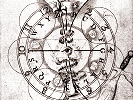

  
[Intangible Textual Heritage](../../index)  [Parapsychology](../index) 
[Theosophy](../../the/index)  [Index](index)  [Previous](clrv00) 
[Next](clrv02) 

------------------------------------------------------------------------

[Buy this Book at
Amazon.com](https://www.amazon.com/exec/obidos/ASIN/0835670953/internetsacredte)

------------------------------------------------------------------------

  
*Clairvoyance*, by C.W. Leadbeater, \[1899\], at Intangible Textual
Heritage

------------------------------------------------------------------------

### CONTENTS

|                                    |                                         |                                 |
|------------------------------------|-----------------------------------------|---------------------------------|
| CHAPTER |                                         | PAGE |
| I.                                 | WHAT CLAIRVOYANCE IS                    | [1](clrv02.htm#page_1)          |
| II                                 | SIMPLE CLAIRVOYANCE: FULL               | [31](clrv03.htm#page_31)        |
| III                                | SIMPLE CLAIRVOYANCE: PARTIAL            | [57](clrv04.htm#page_57)        |
| IV                                 | CLAIRVOYANCE IN SPACE: INTENTIONAL      | [67](clrv05.htm#page_67)        |
| V                                  | CLAIRVOYANCE IN SPACE: SEMI-INTENTIONAL | [99](clrv06.htm#page_99)        |
| VI                                 | CLAIRVOYANCE IN SPACE: UNINTENTIONAL    | [104](clrv07.htm#page_104)      |
| VII                                | CLAIRVOYANCE IN TIME: THE PAST          | [116](clrv08.htm#page_116)      |
| VIII                               | CLAIRVOYANCE IN TIME: THE FUTURE        | [161](clrv09.htm#page_161)      |
| IX                                 | METHODS OF DEVELOPMENT                  | [201](clrv10.htm#page_201)      |
|                                    | INDEX                                   | [219](clrv11.htm#page_219)      |

------------------------------------------------------------------------

[Next: Chapter I. What Clairvoyance Is](clrv02)
