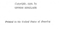

  
[Intangible Textual Heritage](../../index)  [Parapsychology](../index) 
[Index](index)  [Next](mrad01) 

------------------------------------------------------------------------

[Buy this Book at
Amazon.com](https://www.amazon.com/exec/obidos/ASIN/B002FGTN5A/internetsacredte)

------------------------------------------------------------------------

  
*Mental Radio*, by Upton Sinclair, \[1930\], at Intangible Textual
Heritage

------------------------------------------------------------------------

# MENTAL RADIO

##### BY

## UPTON SINCLAIR

###### INTRODUCTION BY

### WILLIAM McDOUGALL

#### NEW YORK

#### ALBERT & CHARLES BONI

#### \[1930\]

Scanned, proofed and formatted at Intangible Textual Heritage by John
Bruno Hare, May 2008. This text is in the public domain in the United
States because its copyright was not renewed in a timely fashion as
required by law at the time.

  [  
Click to enlarge](img/title.jpg)  
Title Page  

 
[  
Click to enlarge](img/verso.jpg)  
Verso  

------------------------------------------------------------------------

[Next: Introduction](mrad01)
