  
[Intangible Textual Heritage](../../index)  [Parapsychology](../index) 
[Index](index)  [Previous](mrad18)  [Next](mrad20) 

------------------------------------------------------------------------

[Buy this Book at
Amazon.com](https://www.amazon.com/exec/obidos/ASIN/B002FGTN5A/internetsacredte)

------------------------------------------------------------------------

  
*Mental Radio*, by Upton Sinclair, \[1930\], at Intangible Textual
Heritage

------------------------------------------------------------------------

p. 148

### XVIII

The casual reader may be bored by too
many of these drawings, but they are easy to skip, or to take in at a
glance, and there may be students who will want to examine them
carefully. So I will add a selection of the significant drawings, with
only brief remarks. I begin with what I have called partial successes,
and then add a few more of those I have called "complete."

Let us return to the early drawings, made by my secretary. On the
automobile ride to Pasadena, there was an ash-can ([fig.
100](#img_fig100)):

 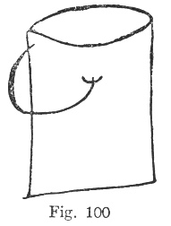

For the above my wife wrote: "I see a chain dangling from
something—resembling little chimney pot on top of house."

And here is design for which the comment

p. 149

was: "These somehow belong together but won't get together" ([figs. 101,
101a](#img_fig101)):

 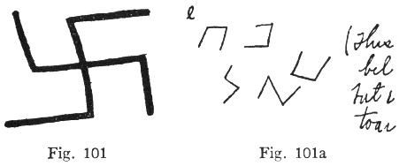

Here is a fan, with comment: "Inside seems irregular, as if cloth draped
or crumpled" ([figs. 102, 102a](#img_fig102)):

 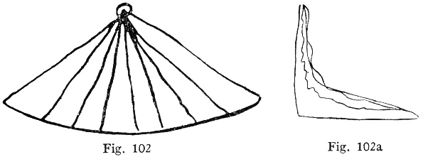

Here is a one-half success ([figs. 103, 103a](#img_fig103)):

 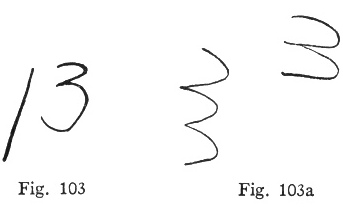

Here is a broom, drawn by my secretary ([fig. 104](#img_fig104)),

p. 150

and several efforts to reproduce it ([figs. 104a, 104b](#img_fig104)):

 

The comments accompanying these drawings read: "All I'm sure of is a
straight line with something curved at end of it; once it came" (here is
drawing of the flower). "Then it doubled, or reappeared, I don't know
which. (Am not sure of curly edges.) Then it was upside down."

The next drawing was a heart, and my wife got the upper half with what
are apparently blood-drops added ([figs. 105, 105a](#img_fig105)):

 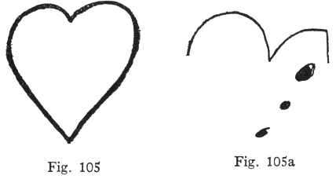

p. 151

The above is interesting, as suggesting that whatever agency furnished
the information knew more than it was telling. For if Craig's drawing, a
pair of curves, constituted a crude letter N, or had no significance,
why add the blood-drops, which were not in the original? On the other
hand, if her subconscious mind knew it was a heart, why not give her the
whole heart, and let her draw it?

So much for the drawings of my secretary; and now for my own early
drawings. When I was a school boy, we used to represent human figures in
this way; and, as you see, Craig got the essentials ([figs. 106,
106a](#img_fig106)):

 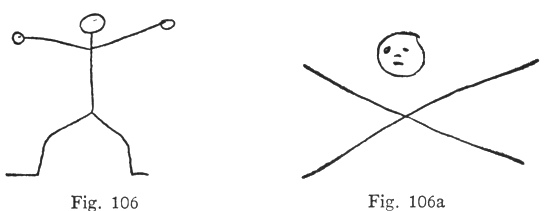

Several weeks later, I drew a pair of such figures in action and the
comment was: "It's a whirligig of some sort" ([figs. 107,
107a](#img_fig107)).

After the following drawing, Craig asked me not to do any more hands,
for the reason that she "got" this, but thought it was my own hand

p. 152

 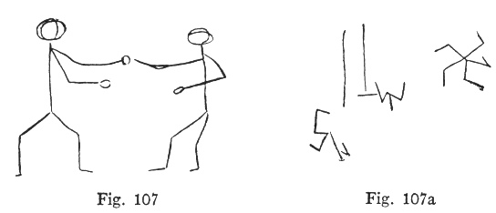

doing the drawing. She guessed something else, and wrote: "Turned into
pig's head, then rabbit's" ([figs. 108, 108a](#img_fig108)):

 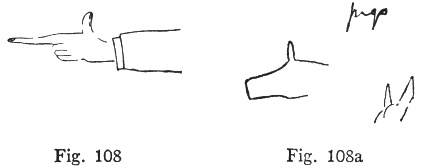

Next, this bat, with very striking comment.

 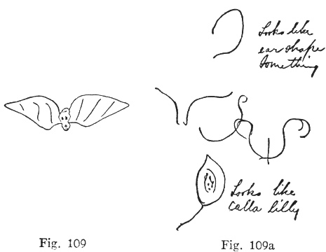

p. 153

\[paragraph continues\] "Looks like
ear-shaped something," and again: "Looks like calla lily" ([figs. 109,
109a](#img_fig109)):

A butterfly net ([fig. 110, 110a](#img_fig110)).

 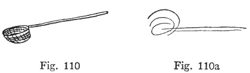

A key ([figs. 111, 111a](#img_fig111)):

 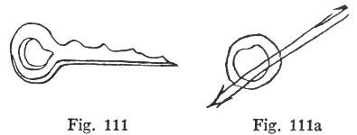

This highly humorous sunrise ([figs. 112, 112a](#img_fig112)):

 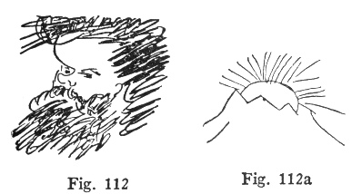

A carnation which came after the preceding drawing, and apparently had
been anticipated in the "sunrise" ([figs. 113, 113a](#img_fig113)).

Note that this camp-stool, as I drew it, really

p. 154

 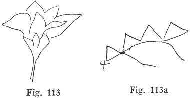

does appear to be standing on water ([figs. 114, 114a](#img_fig114)):

 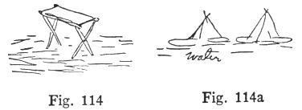

For this little waiter, who follows, no drawing was made by my wife. Her
written comment was: "I see at once the profile of human

 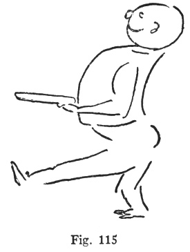

p. 155

face. Am interrupted by radio tune. Something makes me think of a cow.
Now see two things sticking out like horns" ([figs. 115](#img_fig115)).

The following had no comment ([figs. 116, 116a](#img_fig116)):

 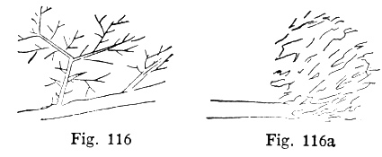

Nor the next one ([figs. 117, 117a](#img_fig117)):

 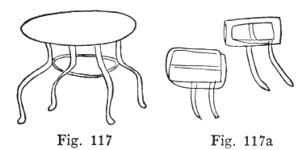

The comment on this caterpillar was: "Fork —then garden tool—lawn rake.
Leaf." I might add that we have a lawn-rake made of bristly bamboo,
which looks very much like my drawing ([figs. 118, 118a](#img_fig118)):

 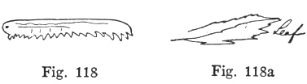

In the following case I drew sixteen stars,

p. 156

and you may count and see that Craig got twelve of them, and made up the
difference with a moon! ([figs. 119, 119a](#img_fig119)):

 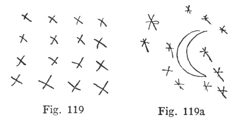

Comment on the following: "Looks like a monkey wrench, but it may be a
yardstick" ([figs. 120, 120a](#img_fig120)):

 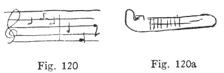

In the next one, the curve of the worm is amusingly reproduced by the
bird's neck. The comment added: "But it may be a snake." Craig says this
is an example of how one part of the drawing comes to her, and then, in
haste, her memory-trains and associations supply what they think should
be the rest ([figs. 121, 121a](#img_fig121)).

The umbrella brings up Craig's reptile "complex" again. I assure you
that in her garden, she turns sticks into snakes when they are far

p. 157

 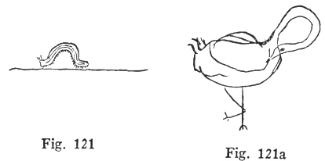

less snake-like than my drawing. Her comment was: "I feel that it is a
snake crawling out of something—vivid feeling of snake, but it looks
like a cat's tail" ([figs. 122, 122a](#img_fig122)):

 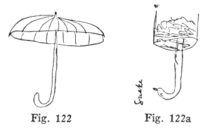

I drew a wall-hook to hang your coat on ([figs. 123,
123a](#img_fig123)):

 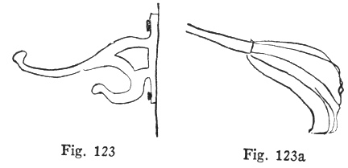

p. 158

A design, evidently felt as a design, though not well got ([figs. 124,
124a](#img_fig124)):

 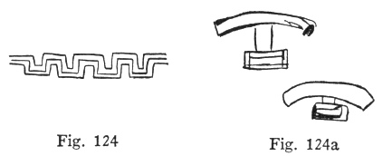

A screw, with comment: "light-house or tower. Too fat at base." If
Craig's drawing were made narrower at base, it would reproduce the screw
very well. Note that in the right-hand "tower" the screw-like effect of
the "set backs" is kept ([figs. 125, 125a](#img_fig125)):

 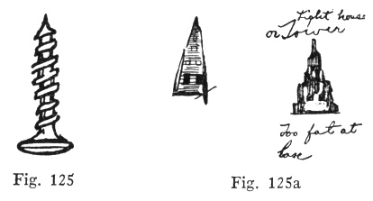  
Fig. 125, Fig. 125a

Here is a love story which seems to go wrong, the hearts being turned to
opposition ([figs. 126, 126a](#img_fig126)):

 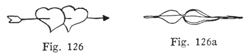

p. 159

Here is the flag, made simpler—"e pluribus unum!" ([figs. 127,
127a](#img_fig127)):

 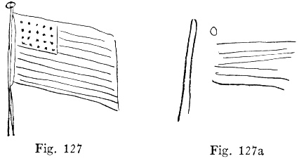

Here is a cow, as seen by the cubists. Comment: "Something sending out
long lines from it" ([figs. 128, 128a](#img_fig128)):

 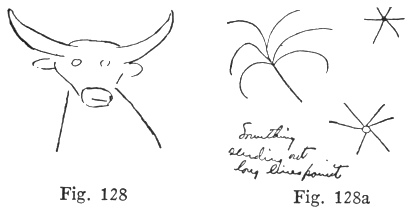

Telegraph wires, apparently seen as waves in the ether ([figs. 129,
129a](#img_fig129)):

 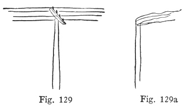

p. 160

Comment on the following: "Horns. Can't see what they are attached to"
([figs. 130, 130a](#img_fig130)):

 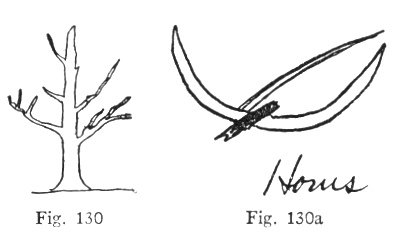

And here is a parrot turned into a leaf, with comment. "See veins and
stem with sharp vivid bend in it"—which seems to indicate a sense of the
parrot's beak ([figs. 131, 131a](#img_fig131)):

 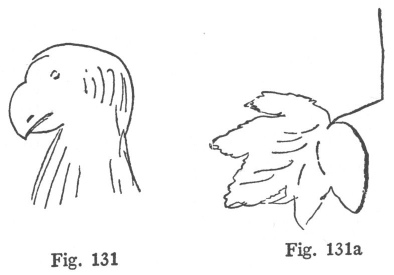

------------------------------------------------------------------------

[Next: Chapter XIX](mrad20)
