  
[Intangible Textual Heritage](../../index)  [Parapsychology](../index) 
[Index](index)  [Previous](mrad19)  [Next](mrad21) 

------------------------------------------------------------------------

[Buy this Book at
Amazon.com](https://www.amazon.com/exec/obidos/ASIN/B002FGTN5A/internetsacredte)

------------------------------------------------------------------------

  
*Mental Radio*, by Upton Sinclair, \[1930\], at Intangible Textual
Heritage

------------------------------------------------------------------------

p. 161

### XIX

The border-line between successes and
failures is not easy to determine. Bear in mind that we are not
conducting a drawing class, nor making tests of my wife's eyesight: we
are trying to ascertain whether there does pass from my mind to hers, or
from my drawing to her mind, a recognizable impulse of some sort. So, if
she gets the essential feature of the drawing, we are entitled to call
it evidence of telepathy. I think the fan with "crumpled cloth" ([fig.
102](mrad19.htm#img_fig102)), and the umbrella handle that may be a
"snake crawling out of something," but that "looks like a cat's tail"
([fig. 122](mrad19.htm#img_fig122)), and the screw that was called a
"tower" ([fig. 125](mrad19.htm#img_fig125))—all these are really
successes. I will append a number of examples, about which there seems
to me no room for dispute, and which I have called successes. The first
is a sample of architecture ([figs. 132, 132a](#img_fig132)):

 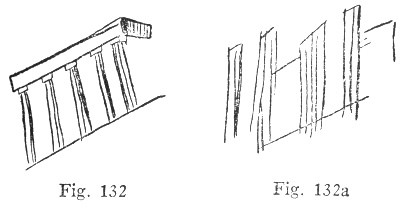

p. 162

And here is an hour-glass, with sand running through it. Not merely did
Craig write "white sand," but she made the tree the same shape as the
glass. I have turned the hour-glass upside down so that you can get the
effect better. It should be obvious that "upside-downness" has nothing
to do with these tests, as Craig is as apt to be holding a drawing one
way as another ([figs. 133, 133a](#img_fig133)):

 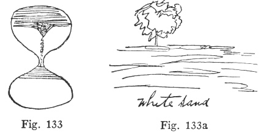

And these three circles, with comment: "Feel sure it is," written above
the drawing ([figs. 134, 134a](#img_fig134)):

 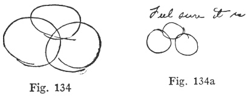

As to the next comment, "Trumpet flower," let me explain that we have
them in our garden,

p. 163

whereas we do not have any musical trumpets or horns ([figs. 135,
135a](#img_fig135)):

 

This strange object from my pencil tried to be a conch-shell, but got a
bad start, and was left unclassified. Craig made it "life bouy in
water," which is good, except for the spelling. She insists upon my
pointing out that shells also belong in water ([figs. 136,
136a](#img_fig136)):

 

p. 164

This one, described in good country fashion, "Muley cow with tongue
hanging out" ([fig. 137](#img_fig137)):

 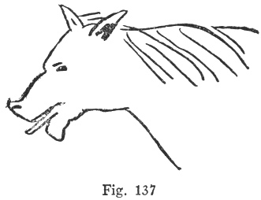

This next one was described by the written word: "Goat" ([fig.
138](#img_fig138)):

 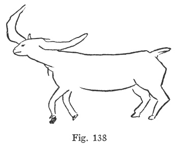

And this one is so striking that I give the words in facsimile ([figs.
139, 139a](#img_fig139)):

p. 165

 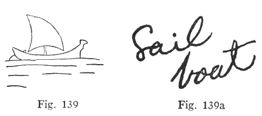

For the following, my wife described a wrong thing, and then added: "Now
a sudden new thing, cone-shaped or goblet-like. This feels like *it*"
([figs. 140, 140a](#img_fig140)):

 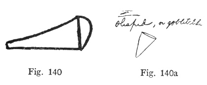

This was correctly named: "2 legs of something running" ([figs. 141,
141a](#img_fig141)):

 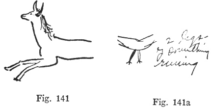

This Alpine hat with feather seems to me no

p. 166

less a success because it is called "Chafing dish" ([figs. 142,
142a](#img_fig142)):

 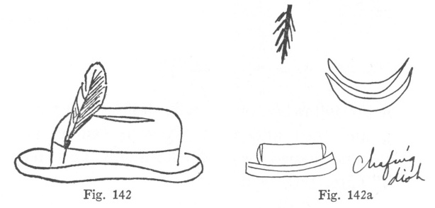

Nor this wind-mill because the sails are left off ([figs. 143,
143a](#img_fig143)):

 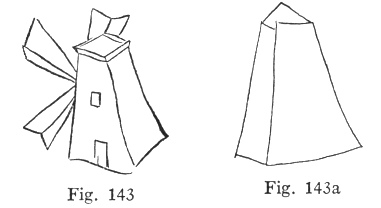

These concentric circles are called "Horn (very curled), or shell"
([figs. 144, 144a](#img_fig144)):

 

p. 167

And here is a curious one, which came early in the tests. I call
attention to the comment about the handle, which ran off the sheet of
paper without any ending, just as she says. "Letter A with something
long above it. Key or a sword, there seems to be no end to the handle.
Think it's a key" ([figs. 145, 145a](#img_fig145)):

 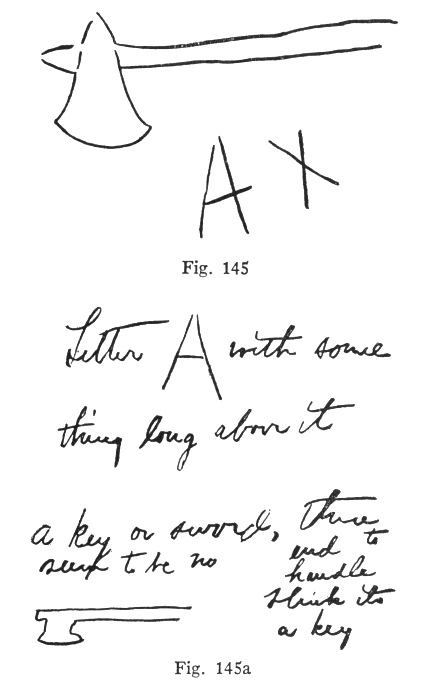

p. 168

And finally, this still more astonishing one, to serve as a climax. Let
me explain that I am not so good an artist as this; I copied my drawing
from some magazine ([figs. 146, 146a](#img_fig146)):

 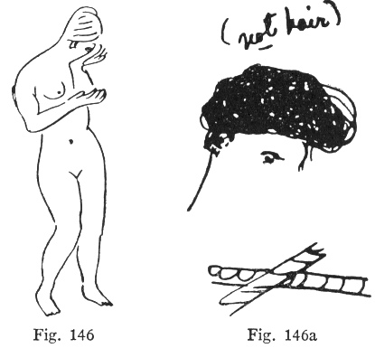

You note that my wife "got," not merely the whole top of the drawing,
but some impression of the arms, which are crossed in a peculiar way. I
ask her about this case—the drawing having been made less than a month
ago—and I find that she remembers it well. She saw what she thought was
a turban wound about the head, and got the impression of color. She
wrote the words "not hair" to make this clear. The rest of the comment
written at the time was: "See back of head, ear, and swirling scarf tied
around head."

------------------------------------------------------------------------

[Next: Chapter XX](mrad21)
