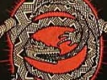

  
[Intangible Textual Heritage](../../index)  [Tolkien](../index) 
[Index](index)  [Previous](two00)  [Next](two02) 

------------------------------------------------------------------------

[Buy this Book at
Amazon.com](https://www.amazon.com/exec/obidos/ASIN/B001VKXH3K/internetsacredte)

------------------------------------------------------------------------

  
*The Worm Ouroboros*, by E. R. Eddison, \[1922\], at Intangible Textual
Heritage

------------------------------------------------------------------------

To W. G. E. *and to my friends* K. H. *and* G. C. L. M.

I dedicate this book

It is neither allegory nor fable but a Story to be read for its own
sake.

The proper names I have tried to spell simply. The *e* in Carcë is long,
like that in Phryne, the *o* in Krothering short and the accent on that
syllable: Corund is accented on the first syllable, Prezmyra on the
second, Brandoch Daha on the first and fourth, Gorice on the last
syllable, rhyming with thrice: Corinius rhymes with Flaminius, Galing
with sailing, La Fireez with desire ease: *ch* is always guttural, as in
loch.

E. R. E.

9th January 1922

 

------------------------------------------------------------------------

[Next: Thomas the Rhymer](two02)
