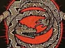

  
[Intangible Textual Heritage](../../index)  [Tolkien](../index) 
[Index](index)  [Previous](two01)  [Next](two03) 

------------------------------------------------------------------------

[Buy this Book at
Amazon.com](https://www.amazon.com/exec/obidos/ASIN/B001VKXH3K/internetsacredte)

------------------------------------------------------------------------

  
*The Worm Ouroboros*, by E. R. Eddison, \[1922\], at Intangible Textual
Heritage

------------------------------------------------------------------------

  [  
Click to enlarge](img/front.jpg)  
GORICE XII. IN CARCË  

TRUE Thomas lay on Huntlie bank,  
  A ferlie he spied wi his ee;  
And there he saw a Lady bright  
  Come riding down by the Eildon Tree.

Her skirt was o the grass-green silk,  
  Her mantle o the velvet fyne,  
At ilka tett of her horse's mane  
  Hung fifty siller bells and nine.

True Thomas he pulld aff his cap,  
  And louted low down on his knee:  
"Hail to thee, Mary, Queen of Heaven!  
  For thy peer on earth could never be."

"O no, O no, Thomas," she says,  
  "That name does not belong to me;  
I'm but the Queen of fair Elfland,  
  That am hither come to visit thee.

"Harp and carp, Thomas," she says,  
  "Harp and carp alang wi me.  
And if ye dare to kiss my lips,  
  Sure of your bodie I will be."

"Betide me weal, betide me woe,  
  That weird shall never daunton me."  
Syne he has kissed her rosy lips,  
  All underneath the Eildon Tree.

THOMAS THE RHYMER

------------------------------------------------------------------------

[Next: Contents](two03)
