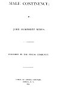
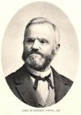

  
[Intangible Textual Heritage](../../index)  [Sacred
Sexuality](../index)  [Index](index)  [Next](mc01) 

------------------------------------------------------------------------

*Male Continence*, by John Humphrey Noyes \[1872\], at Intangible
Textual Heritage

------------------------------------------------------------------------

# MALE CONTINENCE

## BY JOHN HUMPHREY NOYES

### PUBLISHED BY THE ONEIDA COMMUNITY

#### OFFICE OF THE ONEIDA CIRCULAR

#### ONEIDA, N.Y.

#### 1872

This text is in the public domain in the United States because it was
published prior to January 1st, 1923.

[  
Click to enlarge](img/cover.jpg)  
Cover  

[  
Click to enlarge](img/title.jpg)  
Title Page  

[  
Click to enlarge](img/jhn.jpg)  
John Humphrey Noyes  

------------------------------------------------------------------------

[Next: Introduction (Part I)](mc01)
