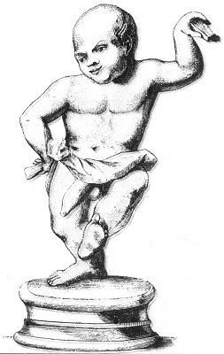

  
[Intangible Textual Heritage](../../index)  [Sacred
Sexuality](../index)  [Classics](../../cla/index)  [Index](index) 
[Previous](rmn14)  [Next](rmn16) 

------------------------------------------------------------------------

 

   
PLATE XIV.

 

p. 30

# Dancer to the Crotalum

BRONZE. *Height, 10 20/25 inches*.

PLATE XIV.

WE have spoken in the explanation of Plate XI. of the moriones, or
fatui, of whom this dancer in bronze is one. He is entirely naked, the
girdle round his loins being, altogether insufficient to conceal his
enormous parts.

He is dancing to the sound of the crotalum. This was a kind of cymbal
made of wood, of terra cotta, or of metal, which almost produced the
sound of the Spanish castanets. It was consecrated to Priapus, and used
in lascivious dances,

Copa syrisca caput graia redimita mitella  
Crispum sub *crotalo* docta movere latus.

VIRGIL, *Copa*.

Cymbala cum *crotalis* prurientiaque arma Priapo  
Ponit, et adducta tympana pulsa manu.

Priapeia, Ep. 26.

This little statue is by no means badly executed; the dancer's pose
sufficiently shows how grotesque, ridiculous, and obscene such dances
were. The statuary took his model from life; one of those wretches whose
occupation

p. 31

was to divert their lords and masters. The more natural they were in
their vulgarity, and the more vulgar in their naturalness, the more they
were appreciated:--

Morio dictus erat, viginti millibus emi;  
Redde mihi nummos, Gargiliane, sapit.

Martial Epig. viii. 13.

------------------------------------------------------------------------

[Next: Plate XV: A Priapus-Hermes](rmn16)
