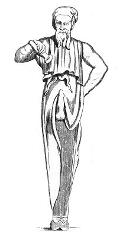

  
[Intangible Textual Heritage](../../index)  [Sacred
Sexuality](../index)  [Classics](../../cla/index)  [Index](index) 
[Previous](rmn15)  [Next](rmn17) 

------------------------------------------------------------------------

 

   
Plate XV.

 

p. 32

# A Priapus-Hermes

BRONZE. *Of the size of the original*.

PLATE XV.

NO doubt this bronze, which was found at Portici, must have belonged to
a votive chapel. It represents an old man whose beard is carefully
combed; his ears, of considerable dimensions, resemble those of a faun.
He is clad in the dress called *talare*, tied round his loins. His legs
seem set in a sheath, and his feet are shod; his tunic is turned up; his
left hand rests on his hip, and with his right hand he pours the
contents of a vase of essences on his phallus. This part of the statue
is out of all proportion. The vase is supposed to contain one of those
compounds to which was attributed the property of restoring to the
athletes of Venus their pristine vigour.

The ancients delighted in mixing aphrodisiac beverages, or what were
held as such, to which the Greeks gave the name of *satyrion*.

Theophrastus, Dioscorides, and Pliny [1](#fn_21)
speak complacently of the essences and ointments which had the property
of giving extraordinary Vigour to the male.

p. 33

It appears, according to these authors, that the tubercles of the
*orchis hircina* served as the basis of aphrodisiac preparations. The
enchantresses of Thessaly dissolved fresh tubercles of this plant in
goat's milk, and thus produced a beverage which they gave to worn-out
old men to rekindle the flames of love in them. On the other hand, in
order to produce a contrary effect and to extinguish immoderate fires,
they made use of tubercles, which being upwards of a year old, were
withered and dry. If we may credit the mythologists, it was by the aid
of such an ingredient that Hercules, having received the hospitality of
Thespius, showed his gratitude to him by ravishing the fifty daughters
of his good host in a single night. Proculus, having taken a hundred
young virgins prisoners, deflowered them all round in fifteen days. A
King of India, named Androphilus, having sent to Antiochus a plant of
the *satyrion* species, Theophrastus declares that the slave entrusted
with this wonderful product boasted of having, by its means offered
seventy sacrifices to Venus in succession. [1](#fn_22)

The Egyptians call a plant which they consider as aphrodisiac,
*chanlendjâam-dgarbi*. This is the *maranta-galanga* of Linnæus.

Only a few years ago there were still to be found in the pharmacopoeia
electuaries and preparations supposed to possess the same property. In
the first rank there figured a kind of lizard, a native of Africa, the
*scincus officinalis*. Taken in the form of powder, it was considered as
a powerful auxiliary in amorous combats. The merchant ships returning
from Alexandria to Marseilles brought back bottles of them, in which
these animals were packed together like anchovies.

Cantharides, truffles, aromatics, several species of mushrooms, and

p. 34

in particular one description, are looked upon as aphrodisiacs. Monsieur
Descourtilz, in speaking of the last-named mushroom, in his
"*Picturesque Flora of the Antilles*, says:--"Careful housewives give
their lovers plenty of it to eat, as an erotic incentive." And further
on he adds: "This species is looked upon as an aphrodisiac, and matrons
do not fail to garnish with it the dishes of young adepts whom they
destine to the first sacrifice to Venus and to revive the torpid spirit
of old stagers who can do nothing but exhibit the same inefficiency over
and over again. The pimento, nutmeg, clove, cinnamon, and ginger mixed
with it, add to the aphrodisiac virtue of this extraordinary mushroom,
and the whole would almost raise a dead man from his grave." [1](#fn_23)

Whatever may be the virtue of these preparations, we can only deplore
the infatuation of those unhappy persons who venture to have recourse to
them. The use of these factitious means, and the venereal excesses they
cause, cannot but lead in a very short time from satiety to despair, and
from despair to death.

Temperance and sobriety can alone defer the term when our amorous
combats must cease.

NOTE.--There exists in the same museum another statuette similar in
everything but the base to that we have just described.

------------------------------------------------------------------------

### Footnotes

[32:1](rmn16.htm#fr_21) THEOPH. *Op*.; DISCOR.
iii. 134; Pliny xxvi. 10.

[33:1](rmn16.htm#fr_22) THEOPHR. *Hist*. ix. 19.

[34:1](rmn16.htm#fr_23) A story is related, on
this subject, of two young girls, fast linked in friendship who were
married on the same day. In a moment of enthusiasm, they pledged
themselves on oath to tell each other every morning the number of
amorous tributes paid them by their husbands during the night. And so
they did. On the morning after their nuptials, the newly-married women,
who lived opposite each other, stood at their respective windows, and
exchanged the signs they had agreed upon between them. With an air
radiant with gladness, the first lifted both hands and showed ten
fingers. The second, blushing and with a drooping head, showed only one
"Poor child," exclaimed her neighbour to herself, p.
35 I pity you indeed to be so badly matched." The following day
the same scene took place, at which the happier of our belles showed
only nine fingers, whilst the other still showed only one. On the third
day the first showed eight, on the fourth seven, on the fifth six, and
on the sixth five, and so on, descending in proportion every day, whilst
her neighbour still continued to show only one finger. These manœuvres
lasted as long as the happier one had something to show and to boast of,
but she shortly after discontinued, and showed her friend only her
clenched hands, a sign of anger as well as impotency, The other,
however, now raised her head proudly, for she was at least able to show
that her daily allowance was still being supplied her with the most
scrupulous exactitude.

------------------------------------------------------------------------

[Next: Plate XVI: Votive Figure](rmn17)
