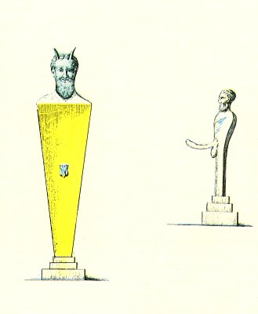

  
[Intangible Textual Heritage](../../index)  [Sacred
Sexuality](../index)  [Classics](../../cla/index)  [Index](index) 
[Previous](rmn17)  [Next](rmn19) 

------------------------------------------------------------------------

 

   
Plate XVII.

 

p. 38

# The Hermes in Bronze.

Of the size of the originals.

PLATE XVII.

FIGURE No. 1 represents the bust of a bearded Pan placed on a Hermes. In
the centre of the latter is the Priapian sign. The head and the phallus
are in bronze.

No. 2 is a grotesque figure, representing the same god.

It cannot be doubted that these little bronze figures were the household
gods of some Roman family. A great many of them have been found, but as
they differ but little from each other, it is useless to describe them
all.

It may be remarked that the custom of worshipping unworthy divinities
was not merely confined to the ancient world. Thus, for instance (if we
may believe Garcilasso de la Vega), in Mexico there were temples
consecrated to the gods of drunkenness, lechery, theft, &c. In fact, the
Mexicans had their Bacchus, their Priapus, and their Mercury. This may
serve as a confirmation of what we maintained in the Introduction to
this book, that, as soon as man emerged from the savage state, his first
religious promptings were directed towards the adoration of the
mysterious powers which tend to the propagation of the human species.
The Mexicans also worshipped the

p. 39

the sun, and with all the nations of antiquity the sun was the principle
of fire. Fire was looked upon as the principle of generation-the
reproductive power, and the genitals as the attributes of the
fertilising divinity of nature. All these, ideas were mixed together in
one common belief, and gave rise to the same identical forms of worship.

------------------------------------------------------------------------

[Next: Plate XVIII: The Tripod](rmn19)
