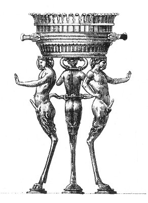

  
[Intangible Textual Heritage](../../index)  [Sacred
Sexuality](../index)  [Classics](../../cla/index)  [Index](index) 
[Previous](rmn18)  [Next](rmn20) 

------------------------------------------------------------------------

 

   
Plate XVIII

 

p. 40

# The Tripod.

BRONZE. Height, 46 7/25 inches.

PLATE XVIII.

HIS wonderful tripod was found in a votive chapel at Herculaneum. The
gracefully-formed corbel is supported by three exquisitely-finished
figures: satyrs with their members erect. They are resting their right
hands on their hips, and closing their middle fingers in token of
silence. They stretch forward their left hands, as if to keep off the
profane, who must not take part in the sacrifice. Their tails are
gracefully entwined round the central ring.

The elegance and perfection of this bronze place it among the most
precious treasures of this mine of antiquities. It would be difficult to
say to which divinity it is consecrated; for the phalluses, the object
of which was to drive away earthly impurities, and to keep off evil
spirits in the solemn performance of a sacrifice, occur indiscriminately
in the temples of Jupiter, Apollo, Mercury, Bacchus, Priapus, Venus, &c.

Tripods, the origin of which is lost in the remotest ages, were
consecrated in most of the ancient forms of worship. As a rule, those
initiated in the mysteries of Delphi, Isis, and Eleusis offered a tripod
in token of their devotion.

The ternary number, which recurs everywhere throughout Nature,

p. 41

physically and morally, played a prominent part in the pagan
rites. [1](#fn_25) It embraced the divinities of
air, earth, and water, of which Jupiter, Neptune, and Pluto were the
lords, and which were indiscriminately called Zeus, the Supreme
Divinity. The Muses numbered *three* times *three*: there were *three*
Graces, *three* Furies, *three* Fates, *three* Hecates, a Cerberus with
*three* heads, &c.

------------------------------------------------------------------------

### Footnotes

[41:1](rmn19.htm#fr_25) As also in Judaism,
Buddhism, Brahminism, and Christianity.

------------------------------------------------------------------------

[Next: Plate XIX: Two Mimic Buffoons](rmn20)
