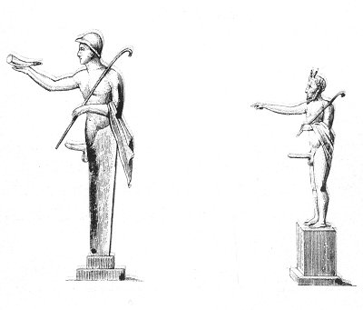

  
[Intangible Textual Heritage](../../index)  [Sacred
Sexuality](../index)  [Classics](../../cla/index)  [Index](index) 
[Previous](rmn20)  [Next](rmn22) 

------------------------------------------------------------------------

 

   
Plate XX.

 

p. 44

# Two Idols

BRONZE.

PLATE XX

No. 1 is a little Hermes bearing the chlamys, the pedum, or pastoral
hook the *pedum*, and the *rhyton*, the horn of an animal, which the
ancients used to drink out of.

Athenæus [1](#fn_26) speaks of these horns, and
also adds that wooden ones were made.

No. 2 is a bearded and homed Faun also bearing the chlamys and the
pedum. His right arm is raised horizontally, and his forefinger is
stretched out in sign of command.

Of this sort of little idols there have been found, in the excavations
of Pompeii and Herculaneum, a number almost equal to that of the little
figures that come to us from Egypt. Their repetition would be tedious
and unnecessary.

------------------------------------------------------------------------

### Footnotes

[44:1](rmn21.htm#fr_26) ATHENÆUS, xi. 7.

------------------------------------------------------------------------

[Next: Plate XXI: Three Bronze Figures](rmn22)
