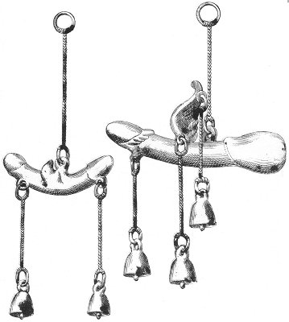

  
[Intangible Textual Heritage](../../index)  [Sacred
Sexuality](../index)  [Classics](../../cla/index)  [Index](index) 
[Previous](rmn26)  [Next](rmn28) 

------------------------------------------------------------------------

 

   
Plate XXVI.

 

p. 54

# Votive Phalli.

BRONZES FROM HERCULANEUM.

PLATE XXVI.

No. 1.

DOUBLE phallus in bronze, with two wings, and two small bells suspended
by little chains.

No. 2.

Another phallus in bronze, winged, and ornamented with three small
bells.

The interpretation of these bronzes may be sought in what has been
already said in relation to the preceding plates or in the Introduction.
We will, however, add that, according to Larcher, the phalluses had not
always the indecent aspect they here bear. They were sometimes
represented in the form of a cross surmounted with a ring, such as is
seen on the Isiac Table in the collection of Egyptian Antiquities [1](#fn_29) of Caylus. The triple phallus was also
represented by a triple cross surmounted with a ring.

------------------------------------------------------------------------

### Footnotes

[54:1](rmn27.htm#fr_29) *Recueil des Antiquites
Egyptiennes*.

------------------------------------------------------------------------

[Next: Plate XXVII: Votive Phallus](rmn28)
