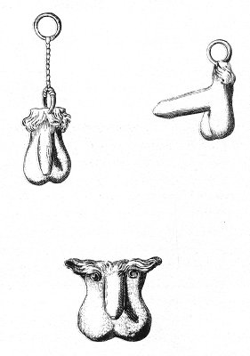

  
[Intangible Textual Heritage](../../index)  [Sacred
Sexuality](../index)  [Classics](../../cla/index)  [Index](index) 
[Previous](rmn29)  [Next](rmn31) 

------------------------------------------------------------------------

 

   
Plate XXIX

 

p. 57

# Bronze Amulets.

PLATE XXIX

THESE three phalluses in bronze are so many amulets which the ancients
were accustomed to wear: the men in order to keep away sorceries, the
women for the same object, and also in order that they might become
fruitful when they wished. Some of these amulets were made of isinglass,
others of bone, ivory, terra cotta, or other material.

Figures 1 and 2 are represented with the rings which were used to
suspend them, and No. 3 is perforated with two holes in the form of
eyes, through which doubtless a chain was passed.

We have already spoken at sufficient length, both in the Introduction
and in the explanation of Plate 7, of the consecration of phalluses, and
we have said that the origin of this practice might be traced to the
mysteries of Isis; but there exists on this subject another version
exceedingly ridiculous and improbable, which nevertheless is dwelt upon
very seriously by grave writers, among others, by Clement of Alexandria
and Arnobius; but Larcher [1](#fn_30) points out
with reason that the Fathers of the Church sometimes allowed themselves
to be so far carried away by their zeal for Christianity, or, rather, by
their hatred of paganism, as to admit for true absurdities which the
heathens themselves would have repudiated.

p. 58

Clement of Alexandria thus seriously endeavours to show how foul was the
origin of the pagan ceremonies Bacchus most ardently desired to descend
to Hades, but he was ignorant of the road thither; Prosymnus offered to
act as his guide, provided he would accord him a recompense. This
recompense would have been dishonourable for any one but Bacchus he was
asked to accord to his guide his secret favours.

"Prosymnus having explained himself more clearly, the god promised, on
oath, to satisfy him, in case he returned from his expedition. Being
guided on the road, he carried out his project; but, on his return, he
learnt that Prosymnus was dead. He forthwith proceeded to his tomb to
acquit himself of his debt, and there invoked his embraces. Having then
broken off the branch of a fig-tree, he cut it into the shape of a
phallus, and seating himself upon it, fulfilled to the dead the promise
he had made to the living.

"After this event, the phallus was carried in procession through towns
in honour of Bacchus, in order to preserve the mystic memory of his
deed." [1](#fn_31)

The following is the version of Arnobius:

"When Nysius-Semelcius Liber [2](#fn_32) was
still among men, he desired greatly to become acquainted with the
infernal regions, and to ascertain what was going on in the realms of
Tartarus. But this curiosity of his was attended by some difficulties,
seeing that, the journey being an unknown one, he knew not which way to
proceed. But a certain Prosumnus, prone

p. 59

enough to improper longings, who had conceived a passion for the god,
arose and promised to point out to him the gate of Dis and the entrance
to Acherusia, if the god would gratify him, and he might be allowed to
take from him uxorious pleasures. The easy god swore by his power and
will that it should be done, but not till he had returned from hell,
safe and sound. Prosumnus courteously showed the way, and stood on the
threshold itself of the infernal regions. In the meantime, while Liber
reviewed curiously the lake of Styx, Cerberus, the Furies, and other
things, his guide was struck off from the number of the living, and
buried according to human fashion. Evyus [1](#fn_33) emerged from the Shades, and finding that
his guide was dead, in order that he might fulfil his compact and
absolve himself from the obligation of the oath he had sworn, proceeded
to his place of burial, and cutting off one of the stoutest branches of
a fig-tree, he chipped, stripped, smoothed, and shaped it into form,
upon which he fixed it in the earth that covered the tomb, and having
stripped himself, sat down on it."

------------------------------------------------------------------------

### Footnotes

[57:1](rmn30.htm#fr_30) Larcher, Note 167 on the
Second Book of Herodotus.

[58:1](rmn30.htm#fr_31) Clement of Alexandria,
Prtrept., page 29.

[58:2](rmn30.htm#fr_32) Bacchus was surnamed
*Liber*, because wine delivers from all care, and sets the mind at
liberty; *Nysius*, from Nysa, the name of his nurse; *Semeleius*, from
Semele, his mother.

[59:1](rmn30.htm#fr_33) Another surname of
Bacchus, derived from *Evohe*, his war-cry.

------------------------------------------------------------------------

[Next: Plate XXX: The Surprised Nymph](rmn31)
