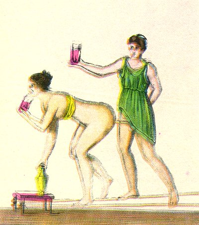

  
[Intangible Textual Heritage](../../index)  [Sacred
Sexuality](../index)  [Classics](../../cla/index)  [Index](index) 
[Previous](rmn35)  [Next](rmn37) 

------------------------------------------------------------------------

 

   
Plate XXXV.

 

p. 71

# Spinthria

FRESCO FROM POMPEII.

PLATE XXXV.

TWO rope-dancers, a man and a woman, are indulging themselves while in a
state of perfect equilibrium. In this singular painting we have before
us one of those scenes of orgy which were the delight of Nero and
Tiberius. The actors in it, placed on two out-stretched ropes, caress
each other without losing their equilibrium, and drink without spilling
a drop of the liquor contained in their glasses.

This fresco, remarkable for its purity of design and brilliant
colouring, is obscene to a degree. It appears indeed that, if the hero
of the occasion has not lost his balance, he has at least lost his way,
and gone completely astray. In a word, such is the position of these
ardent acrobats that we cannot do otherwise than conclude that the
artist supposed the chief actor intended to claim from his fair
companion that shameful favour which Martial could not obtain from his
wife, but which, if he may be believed, discreet matrons accorded to
their husbands:--

Sweet heart, begone, or use our ways with us,  
I am no Curius, Numa, Tatius.  
Nights spent in pleasant cups best please my sense,  
Thou to drink water canst rise and dispense. p.
72  
Thou joy'st in darkness, I by light to sport,  
Or else by day to loose my breeches for 't.  
Swathes or coats cover thee, or obscure stuff,  
No wench to me can lie display'd enough,  
Such kisses please like doves that are a-billing,  
Thou smack'st me like thy granddam, so unwilling,  
Nor towards the work dost voice or motion bring,  
Nor hand, but makest it as some offering.  
The Phrygian boys in secret spent their seed  
As oft as Hector's wife rid on his steed.  
Whilst her lord slept, Penelope, though chaste,  
Was wont to play her hand below her waist.  
Thou'll not be ------, although Gracchus' wife,  
Pompey's and others did it without strife.  
And when the boy not present was,  
It is said, To fill wine, Juno was Jove's Ganymede.  
If gravity by day doth thee delight,  
Lucretia be; I'll have thee Lais by night." [1](#fn_40)

The vice, of which this fresco seems to be a representation, has been
perpetuated openly enough, in warm countries, to the present day. We
must not be understood to speak of the disgusting caresses of two
persons of the same sex, but of the kind of union Cornelia accorded to
Gracchus, Julia to Pompey, and Portia to Brutus.

If the men of the South may be credited, their wives do not always look
upon this connection merely as an act of complaisance on their part.
This singular custom must, perhaps, be accounted for by the influence of
the climate, which inspires such quick and burning desires that it
appears at first sight impossible to extinguish them by the vulgar and
ordinary methods of enjoyment; and in seeking to refine their pleasure,
they deprave

p. 73

it, The same influence also acts on the physical organization of
Southern women; their favours offer such material facilities, that it
might be feared disgust would succeed to love without the stimulants
capable of re-awakening the ardours of the latter. And, finally, such
faults might be accounted for with regard to certain women by the fear
they have of the consequences of their weakness when they act
imprudently with men. An eloquent writer on Love [1](#fn_41) thus speaks on this subject: "Such a
departure from propriety in women would excite little indignation if
prudence alone could render a departure from propriety lawful. They are
desirous, it might be said, of escaping from the disquietude and from
all the dangers of a more natural union. Ought the sex which does not
pardon them to disguise from itself that they have too good reason to
fear what they would doubtless have chosen, and that too often that
which they must necessarily always prefer becomes fatal to them. Let us
not be eager to judge them; and, without justifying them, let us admit
that they may daily be placed in embarrassing situations, and that such
difficulties extenuate many faults."

------------------------------------------------------------------------

### Footnotes

[72:1](rmn36.htm#fr_40) MARTIAL, xi. 105. R.
Fletcher's Translation, 1656.

[73:1](rmn36.htm#fr_41) M. de Senancour.

------------------------------------------------------------------------

[Next: Plate XXXVI: Mercury and Yphtima](rmn37)
