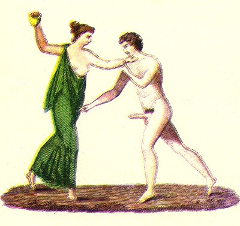

  
[Intangible Textual Heritage](../../index)  [Sacred
Sexuality](../index)  [Classics](../../cla/index)  [Index](index) 
[Previous](rmn38)  [Next](rmn40) 

------------------------------------------------------------------------

 

   
Plate XXXVIII.

 

p. 72

# Spinthria

FRESCO FROM POMPEII.

PLATE XXXVIII.

THIS fresco was discovered in 1826, at Pompeii. It is supposed that the
house where it was found was one of those places of debauchery called
*lupanaria*. In one of the principal rooms of the house may be seen a
painting representing some youths and courtezans abandoning to the
pleasures of the table and to play: one of the young men, the hero of
the fresco we are describing, heated, doubtless, by the fumes of wine,
is pursuing a woman. His gestures leave no doubt as to the nature of his
intentions; but his fair companion, alarmed at the sight of the
prodigious instrument with which he menaces her, seizes her lover by the
throat, and endeavours to push him back: she even seems on the point of
hurling at his head a vase which she holds in her right hand.

The drawing of this fresco presents several imperfections, and the
youth's left arm, though meant to be foreshortened, is evidently not
long enough.

We mentioned in our Introduction that the Greeks called these sort of
paintings *grylli*, and the Romans *libidines*. They were designated by
a

p. 79

more emphatic expression when they were more than usually indecorous,
viz., *Spinthria* (debauchery), from σπινθὴρ, a spark. We shall
henceforth make use of this term, as more appropriate to the paintings
which remain to be described.

------------------------------------------------------------------------

[Next: Plate XXXIX: Spinthria](rmn40)
