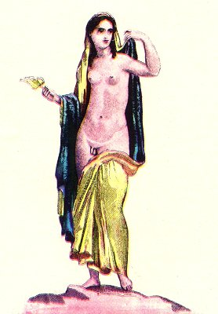

  
[Intangible Textual Heritage](../../index)  [Sacred
Sexuality](../index)  [Classics](../../cla/index)  [Index](index) 
[Previous](rmn40)  [Next](rmn42) 

------------------------------------------------------------------------

 

   
Plate XL.

 

p. 82

# An Hermaphrodite.

Height, 49½ inches. Width 32 10/25 inches.

PLATE XL.

THIS figure represents an hermaphrodite full of grace, youth, and
beauty. We have given some particulars respecting these fabulous beings
in the Introduction to this work; and we have also explained why the
leaf of the water-lily was consecrated to them.

The hermaphrodite here represented gracefully raises the mantle in which
he is enveloped, and reveals at one and the same time the organ of
virility and a woman's breast.

An attentive examination of this painting will show that such a being
could not exist. The beauty which glows in every one of his limbs; the
softness revealed by the rounded forms; everything, in this figure,
betrays a sensible and passive being, created for resistance and defeat;
there is nothing there, on the other hand, to indicate the vigour and
boldness of character which is the birthright of the sex made to attack
and to conquer.

This fresco was among the excavations of Pompeii.

------------------------------------------------------------------------

[Next: Plate XLI: An Hermaphrodite and Faun](rmn42)
