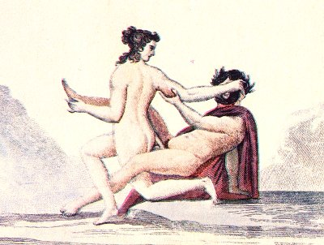

  
[Intangible Textual Heritage](../../index)  [Sacred
Sexuality](../index)  [Classics](../../cla/index)  [Index](index) 
[Previous](rmn43)  [Next](rmn45) 

------------------------------------------------------------------------

 

   
Plate XLIII.

p. 86

# A Faun and Bacchante

FRESCO FROM POMPEII.

PLATE XLIII.

A FAUN is engaged in contest with a nymph. The originality of the poses
is not less remarkable than the purity of the drawing.

An amorous encounter has sprung up between the god and the nymph: the
former slips and falls, but it does not appear his fair companion
desires seriously to take advantage of this accident in order to escape
the fate which awaits her. It Is evident that she defends herself
feebly: her features, her inflamed look, her nakedness, all betray that
she is willing to be vanquished. She knows that her own defeat will
furnish her with new arms to subjugate and enchain the happy conqueror
in his turn.

In the background of this fresco is a very simple landscape, not well
preserved.

------------------------------------------------------------------------

[Next: Plate XLIV: Spinthria](rmn45)
