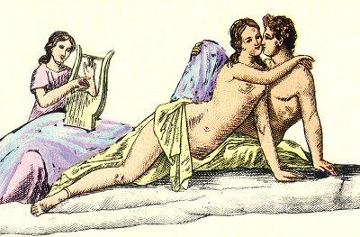

  
[Intangible Textual Heritage](../../index)  [Sacred
Sexuality](../index)  [Classics](../../cla/index)  [Index](index) 
[Previous](rmn50)  [Next](rmn52) 

------------------------------------------------------------------------

 

   
Plate L.

 

p. 98

# Aeneas and Dido.

FRESCO FROM HERCULANEUM. *Height, 14 23/25 inches, breadth, 29 6/25
inches*.

PLATE L.

THIS fresco was one of the earlier discoveries, and was published by the
Academicians of Herculaneum, and by Sylvain Maréchal, who considered the
subject to represent Bacchus and Ariadne. They give as a reason for this
interpretation the crown of leaves which may be observed, though not
without some difficulty, on the head of the supposed Bacchus, as if it
were not notorious that in erotic subjects the ancients usually
represented their actors crowned with flowers and leaves. [1](#fn_48) The third person seen in the background
seems to us triumphantly to refute the assertion, seeing that Bacchus
surprised Ariadne alone in a desert island. We look upon the following
explanation as a more probable one:--

Dido has been informed that Æneas intends to fly; she implores him to
give up this fatal project; and calls to her aid, in order to retain the
hero,

p. 99

all the resources of love and beauty, which her sister Anna heightens,
by the melody of her notes, the seductive illusion of this love-scene:--

Base and ungrateful, could you hope to fly,  
And, undiscover'd, 'scape a lover's eye?  
Nor could my kindness your compassion move,  
Nor plighted vows, nor dearer bonds of love?  
Or is the death of a despairing queen  
Not worth preventing, though too well foreseen?" [1](#fn_49)

However the case may be, and if we take this to be merely a domestic
scene, the third personage may be supposed to be a female musician,
*citharistria*, placed at the door of the bed-chamber, and singing the
Epithalamium.

------------------------------------------------------------------------

### Footnotes

[98:1](rmn51.htm#fr_48) The Greeks and Romans,
in their pleasure parties, crowned each other with the flowers which the
season produced, especially with roses, to temper or dissipate the fumes
of wine. They were first fastened to a linen or flaxen fillet, with
which they bound their foreheads to avoid headache, the general
consequence of drunkenness. A crown, interwoven with roses, violets, and
ivy, was held to be the most salutary remedy against the heat of
wine."-(J. B. LEVEE, *in Plauto*.)

[99:1](rmn51.htm#fr_49) ÆN. iv. (*Dryden's
Translation*).

------------------------------------------------------------------------

[Next: Plate LI: Spinthria](rmn52)
