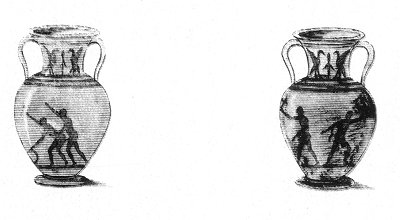

  
[Intangible Textual Heritage](../../index)  [Sacred
Sexuality](../index)  [Classics](../../cla/index)  [Index](index) 
[Previous](rmn60) 

------------------------------------------------------------------------

 

   
Plate LX.

 

p. 122

# Langelle Vase.

PLATE LX AND LAST.

THIS graceful langelle represents one of the most extraordinary of the
gymnastic games known to the ancients. On one side may be seen two
athletes armed with a kind of axe; on the other side the hoop has been
substituted for the axe, and the conquered now undergoes the law of the
conqueror. While the former stoops to pick up the disk he has clumsily
dropt, the latter draws near him and prepares to enjoy his person: this
was the law of the game. We may laugh at or despise the vanquished man,
but we cannot envy the glory of the conqueror.

On each side of the neck of this vase is painted a thyrsus guarded by
two cranes, coarsely drawn.

The number of Grecian vases with obscene figures is considerable, and
some are to be found in most large collections. We do not, however, know
of more than about half-a-dozen in the Naples Museum, independently of
those we have just explained. The subjects they represent are so very
much akin to the preceding, that it would have answered no purpose
either to reproduce or to dwell upon them.

END OF THE NAPLES MUSEUM.

 

 
