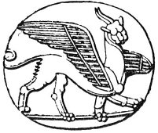

  
[Intangible Textual Heritage](../../index)  [Sacred
Sexuality](../index)  [Index](index)  [Previous](tsf02)  [Next](tsf04) 

------------------------------------------------------------------------

[Buy this Book at
Amazon.com](https://www.amazon.com/exec/obidos/ASIN/0806504560/internetsacredte)

------------------------------------------------------------------------

*The Sacred Fire*, by B.Z. Goldberg, \[1930\], at Intangible Textual
Heritage

------------------------------------------------------------------------

p. 1

# BOOK ONE

### FAR AWAY AND LONG AGO

p. 2

|                                                                                                                    |
|--------------------------------------------------------------------------------------------------------------------|
| " . . . *and thou shalt love the Lord thy God with all thy heart, and with all thy soul, and with all thy might*." |

p. 3

### CHAPTER I

### FAR AWAY AND LONG AGO

#### I

FAR away and long ago a gibbon slid down a tree. Once on the ground he
did not feel like climbing up again. Life seemed so much better below
than above; only he realized he had to change a thing or two in his mode
of living. He had to walk erect, for instance, rather than crawl on all
fours. He had to perfect as well the use of his anterior limbs and to
make hands out of them. And so it was that when the gibbon raised his
head toward heaven and stretched his arms forward, he himself came to
proceed forward as well. He was started on the way to human form.

It was then that the animal that was once gibbon or akin to the gibbon
ventured out on its big climb again, not on the branches of a tree, but
on the rungs of the ladder of civilization. Man burned the animal
bridges behind him, for he saw no other way of living but to make the
best of whatever humanity he possessed.

Today, if you see an aeroplane soaring in the sky, you may know it is
all due to that enterprising gibbon that slid down the tree. Had he been
content to remain swinging on the branches, that which today passes for
mankind might have been just another form of gibbon.

p. 4

#### II

Once humanized, the gibbon was driven further toward humanity by the
lash of Dame Care. Because he was defenceless against the storm, he
betook himself to the shelter of the rocks and caves. Because he was not
equal to the demands that his new environment set up for those who would
survive, he developed tools and implements. Because he was afraid of the
prowling beast, he cultivated a taste for sociability. He took to
wandering with his kind so that, with the help of others, he might
conquer his foes against whom he was powerless alone. And because he
lived in groups, he acquired a desire for the approval of his fellow
creatures and was forever trying to outdo himself in every prowess his
particular group considered worth while.

It was Dame Care that forced the humanized gibbon to trudge along the
path of progress, but there were two other mighty forces that drew him
to the great kingdom that was to be his. They, too, were his constant
companions, leading him into the great spiritual world that he was to
inherit. They made his life bearable in moments that were most trying;
they added a drop of exaltation to his cup of drab existence. They were
the prizes that were held out to the little school-boy of civilization,
to be his when he made the grade. They were the pillars of fire in the
darkness through which the gibbon walked into the promised land of
humanity. They were: LOVE and RELIGION.

#### III

Both were doubtless very crude ere man first consciously called them by
these designations. Love was probably only

p. 5

a physical overpowering of the female in a passing moment of passion, or
winning her favor by appearing at an advantage in comparison with his
fellows. Or perhaps it was, as it sometimes is today, a case of barter.
He may have thrown her a banana or a nut, for which she, in return,
received him in her chambers.

And religion was probably equally crude in the beginning. It was a
mixture of fear and bribery. The strong fellow was dangerous in life and
so he was in death. For, although his body returned to nothingness, his
double, or soul, did not die but became even more powerful now,
unbounded, as it was, by space and time. The man who was a devil when
living became a demon after death. There was only one way of fighting
him and that was by magic, but even magic was not always effective. It
was rarely so in the case of the very strong demons. So it seemed more
sensible to appease the evil spirit, to do it homage and to present it
with the things it had liked when it was merely human. Religion may have
had its origin as humbly as in bribing off the pernicious soul of some
rascal in the tribe.

Still, there was something inherent in these prehistoric experiences of
love and religion that potentially contained all the elements of which
this rare fabric has been woven through these many thousands of years.
Crude as the beginnings were, they contained the makings of the great
phases of life that these forces came to be.

Even when love was a brief, physical, sex hunger, it embodied something
more. Man was the first animal to abolish the rut or sexual season.
Early man, like man today, was potentially ever ready to mate. He was
already possessed of a conscious memory and an active imagination. As he
lay basking in the sun after a satisfying meal, his

p. 6

memories probably wandered over his sex experience of the previous day,
dwelling upon the particular female that had afforded these pleasures;
possibly upon her cooperation in the attempt to make them more
gratifying. He may have felt a certain amount of gratitude toward her,
as an intelligent animal might, or he may merely have felt kindly
disposed toward her, as we usually are today toward people who have
shared with us some joy or happiness. In his fancy he may have been
reliving with her these intimacies. In short, promiscuous as the
original sex life of man was, cruelly and brutally as it may have
expressed itself, it still contained the trace of an attitude toward the
object of his desire. There was no suggestion of such an attitude toward
the meat that stilled his hunger, or the water that quenched his thirst.
Out of this attitude grew love, even such great love as that between
Abélard and Héloïse.

Similarly, the warding off of evil spirits, which may have constituted
early religion, was an expression not only of fear but of awe as well.
What man is forced to fear interminably will necessarily rise in his
estimation and become an object of awe and adoration. It was true in the
past—physical strength was idealized in the primitive world, and the
might that induced fear was admired and envied. It is true today—man's
own self-respect demands that whatever he sets above himself, shall grow
to superior proportions, that whatever he subjects his own personality
to, shall become idealized and raised to the plane of the superhuman.
This explains the metamorphosis of a man to a god—hated and despised by
his tribe in life, he becomes a deity for their worship after his death.

Once the demon became an object of awe and reverence, he was idealized,
at least in part. He took the form of man's

p. 7

wish-content. All that man wished to be himself, he projected into the
object of his reverence. Naturally, he sought, as he does to this day,
to follow his idealized personality, not only to do it homage, but to
emulate it as well. As man turned the demon into a god he learned to
walk humbly before it. Thus, crude, primeval fear that lurked in the
human heart before the dawn of the gods already possessed the basic
elements that enter into universal religious experience.

#### IV

Now the two, love and religion, have been inseparably intertwined all
through the history of mankind. We are all aware of the element of
religion in love. The very religious term "adore" is a prime favorite in
love's vocabulary. We all know of the implicit faith of lovers, how
blind they can be to the flagrant faults of the beloved. We also know
how all-pervading and overpowering love may be. Like religion, it may
bring one to the loftiest heights of bliss and to the depths of despair,
so that he may sacrifice everything for it, even his very life.

To a much larger extent, love has been identified with religion. The
fervor of religion seems naturally to induce the ecstasy of love. Pagan
religious rites generally ended in open sex orgies. Whatever behavior
bonds on the sex impulse existed within the tribe were lifted for the
moment. Sex indulgence that was so taboo as to be punishable by death
was permitted in religious worship and was entered into with a
vengeance.

The Greeks and the Romans followed the pagans in the worship of
fertility gods. To this very day, millions of people practise
circumcision as a religious duty, a symbolic

p. 8

signature of a covenant into which their forefathers entered with their
God, a signature of an undoubtedly erotic meaning.

The religion of western civilization is based on a mystic conception of
the union of a human virgin with the Spirit of God. Carnal love has
become unworthy, profane, and in its place must be substituted spiritual
love for the divine being. Spiritual love, but love nevertheless.
Suffice it only to mention the evangelistic revivals with their sudden
conversions, which psychologists are wont to compare with sexual
ecstasy, and the highly erotic symbolism in modern religion. The more
one studies, not religious dogma or philosophy, but religious living as
it is experienced by people all over the world, the more one is bound to
nod assent to the sign often seen on the windows of missions: "God is
Love."

   
Phallic symbols in ancient art

p. 9

#### V

How did love come to religion? Is there a clear distinction between the
experience of love and that of religion? How has love fared within
religion these many thousands of years of religious development?

There are a number of ways in which man today may look upon religion. He
may conceive o; it as truth divinely revealed to him by his Maker, as is
believed by the faithful. He may look upon it as mere superstition, a
projection of man's subjective mind—a dog as it were chasing his own
tail, taking it for something foreign to him—elaborated according to the
theory of Sigmund Freud. He may see religion as an innate tendency, the
functioning of a special instinct, the interpretation advocated by
Professor E. D. Starbuck to the utter dismay of Doctor John B. Watson.
Again, he may be psychologically more cautious and, instead of viewing
it as the result of a special innate tendency, take it as an outgrowth
of other instinctive reactions, such as the herd instinct, agreeing with
Trotter; or the sex instinct, following Schroeder; or, like McDougal, he
may make religion the focal point of several instinctive tendencies,
such as awe, admiration, and reverence. He may even agree with Thouless
that religion is not so much a thing in itself as a mode of living. This
view makes it the outlet supreme for man's all-instinctive craving, the
expression of all the urges in his heart, a channel into which he may
pour all that is burdening his soul.

However one looks upon religion, he cannot avoid the issue of love, love
ever present, ever stirring, ever coloring the very essence of true,
devotional, and exalted religious experience.

p. 10

This book will undertake to trace the path of love in religion. It will
follow the stream from its very source, down all its tortuous windings
through the centuries: crude sex passion, physical love, love refined
and idealized, and love sublimated and esthetically symbolized. In doing
so we may find it necessary to digress here and there in the dimly
lighted past. We may have to wade through what to some may seem muddy
waters. Still, it will all be for love and religion. Instead of
discouraging, it should be a source of lofty inspiration and esthetic
intrenchment. Ours will be a course following the light out of the
darkest forest, as it grows ever higher, clearer, purer, and more
beautiful.

 

------------------------------------------------------------------------

[Next: Chapter II. Primitive Man in Love and Faith](tsf04)
