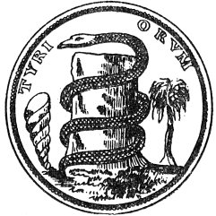

  
[Intangible Textual Heritage](../../index)  [Sacred
Sexuality](../index)  [Index](index)  [Previous](tsf19)  [Next](tsf21) 

------------------------------------------------------------------------

[Buy this Book at
Amazon.com](https://www.amazon.com/exec/obidos/ASIN/0806504560/internetsacredte)

------------------------------------------------------------------------

*The Sacred Fire*, by B.Z. Goldberg, \[1930\], at Intangible Textual
Heritage

------------------------------------------------------------------------

p. 330

### CHAPTER III

### THE REVOLT AGAINST RELIGION

FOR all their common basis in sex, the various religious sects have
their own modes of departure from the accepted institutionalized
religion. Whatever the ultimate motive for the break, it occurs where
the hold is weakest. The religious rebel will inveigh against the most
apparent abuse and elaborate upon it. There has always been rebellion
against authority in the church, so typical of Korah's uprising against
Moses. One who would not submit, questions the authority of saint or
leader. Diakonus Nikolaus was such a rebel and he lived in the very
beginning of the Christian era.

Nikolaus had been separated from his wife. After he became a Christian,
he took her back, not out of passion or for sexual designs, but to
manifest his own continence. "Behold he will be with his own wife and
yet he will so be with her, as if he were not."

But Paul failed to take cognizance of the noble and chaste intentions of
Diakonus Nikolaus. To him, it was the case of another convert going
wrong, giving in to the call of his pagan flesh. Consequently, he
chastised Nikolaus in public for his betrayal of the faith and for his
succumbing to the desires of the flesh. Nikolaus resented this greatly.
Had he lived in another age and under the spell

p. 331

of asceticism, he would have been glad of this public disgrace. He might
even have offered it to God as an act of penance, just as he would a
self-inflicted torture. But he lived in a militant age. After all, who
was this Paul to assume the mantle of the Christ and, in the name of
Jesus, to promulgate ideas that occurred to him alone?

And so Diakonus Nikolaus resolved to break with Paul and go his own way.
He would be a second Paul, but in his own fashion. He at once dropped
all the paraphernalia that the apostles had already gathered around the
faith of Christ and directed himself to the very foundation of the
belief.

There was a good and just father in heaven, who has sinful children here
below. That these children might not perish spiritually as well as
bodily because of their sins, He sent His own son, Christ, to lead an
earthly life as one of them. And by Christ's own blood, shed upon the
cross, he washed away the sins of his father's children and saved their
souls for life eternal.

It was Christ's duty, then, to save the sinners. He was—if one may say
so with due respect—a life-guard appointed to rescue people who were
drowning in the ocean of sin. The larger the number of persons in danger
and the stormier the ocean, the greater proves the guard, who in the
face of these odds, manages to save the unfortunate ones. Consequently,
the more sin in the world, the greater the glory of the savior. The
sinner's soul is dearer to God than the soul of the innocent man, for
with the spotless soul, God has no relationship except a negative one,
while in the soul of the sinner He takes a direct interest. It was to
save the sinner that He sent His son to earth, where he lived and died
upon the cross. There is more

p. 332

rejoicing in heaven over the salvation of one sinner than over that of a
dozen just men. It adds to the glory of Christ and gladdens the heart of
the father.

And just because sex was the greatest of sins, it was chosen as the sin
to be indulged in most. The Nikolaits would gather at their
meeting-places and throw aside all restraint. Everything that one
desired to do, he was to do, not by permission, but by commission, by
the order of the Most High. Not only was there union of the sexes at the
gatherings, but these unions were promiscuous, respecting neither age
nor blood relationship, just as they were in primitive times and still
are, on the banks of the Niger or in the woods of Australia. Nikolaus
thus had complete revenge on Paul. He used the apostle's faith and dogma
to attain the very opposite end.

#### II

In the Mormon church, we have another revolt against church authority.
In this case, it was an uprising against the Canon. The doctors of the
church have always maintained that the cycle of the scriptures has long
been completed. But here was a new testament offered to man by God,
through his humble servant, Joseph Smith. This testament was an
assertion of the value of modern man, who had been reduced to a mere
mechanism. There was no place in the church for his self-expression. His
personality was hidden beneath the prescribed ritual and devotions. He
could only offer prayers and receive communion.

Pioneer life in America offered even less room for the play of
individuality. Here the person was submerged in the work he had to do.
It was the work that counted, not the man who did it. But the pioneer
age was speedily

p. 333

passing away, especially in the East. Man came back to his own. He
sought a place under the sun for his ego, for his personality so long
suppressed. Spiritualism was among the first outbreaks of his inner
independence. There was more to the individual than what was thought of
him in the village or town. He had a soul which was everlasting and
forever active in human life. Spiritualism forebode the imminence of a
divine spirit, which is above and beyond crude nature and the physical
life. Like most leaders of religious movements, the founder of the
Mormon church little appreciated the forces in his environment that led
to the establishment of his church and contributed to its phenomenal
success. Joseph Smith was carried in on the crest of a wave of
individualism that he was hardly capable of understanding.

One day, he heard the angel Moroni addressing him, directing him to
Mormon Hill, where the Gold Bible was to be found. It was a new
scripture, proclaiming the divinity of man: God makes His will known to
His people by continuous revelations. No longer are they to seek
sustenance in the stale food of the Canon, but they are to find it
through direct contact with the Divine Presence. Saints lived, not only
in the remote past, but they are among us even now—Latter Day Saints.

So far, Mormonism is only theologic and sympathetically so. Its prime
object is to increase the dignity of mankind and to raise each
individual in the esteem of his fellow men. But what a small place all
this now occupies in the actual life and thought of the Mormon people!
On the other hand, sex permeates their entire creed. No institution or
doctrine is regarded as more important, and no ceremony is performed
with greater reverence than is

p. 334

the marriage rite. For the business of the saints in heaven is to
propagate souls for bodies begotten on earth. The glory of the saint is
in proportion to the number of wives and children with which he can
credit himself. Polygamy is then a very urgent requirement and a solemn
duty. So it was that Joseph Smith married a number of women, and Brigham
Young counted his wives at twenty-five.

Further, since no marriage is sacred unless solemnized by the Mormon
priest, who alone possesses the divine authority, a woman married to a
"gentile" is actually not married at all. Therefore, a Mormon man does
not commit adultery if he has intercourse with her. Joseph Smith himself
had at least two wives who were living at the time with non-Mormon
husbands, the latter being ignorant of their mates' deception. Brigham
Young had no scruples about seducing a woman in Boston, as she was the
wife of a "gentile." Her husband was duly granted a divorce on the
grounds of adultery.

Since a woman cannot be saved except through her husband whom she must
meet in heaven, she is united for eternity to the man she marries. If,
however, her husband dies, she is not released from her religious duty
of multiplying, and replenishing the earth. So, although her first
marriage is an eternal one, she must provide herself with a substitute
husband, who, for the time, enables her to fulfill her duty. On the
morning of the first resurrection, this man must yield her with all her
posterity to the legal and lawful husband. There are, then, two degrees
of husbands, one for eternity and another for a temporary purpose. The
latter is to beget children for the greater exaltation of the other, the
husband for eternity.

The sexual life among the Mormons has been so ordered

p. 335

as to protect the priesthood and to provide for them all possible
conjugal joys. It requires a higher power than a bill of divorce to take
a woman from a man who is good and honors his priesthood. It must be a
man who possesses a high power in the priesthood, or else the woman is
bound to her husband and will be forever, in the words of Brigham Young.
And Apostle Orson Pratt expounds thus: "Since the wives all belonged to
God and Brigham Young was His agent, hence for all practical purposes
they all belonged to Brother Brigham."

And another apostle, Jedediah Grant, defending Joseph Smith against the
charges of attempting to seduce the wives of apostles and other
prominent men of the church, asked: "Did the Prophet Joseph want every
man's wife that he asked for?" When the attempted seduction was
successful, it was "sensual joy for the love of God." And this turned
out to be the prime motive in the religion of the Mormons: sensual joy
for the love of God. The wave of individualism had its influence, and
the theologic tenets of Latter Day Sainthood left their mark. But above
all was the motive of sex, permeating the very essence of the religion
and the lives of its apostles and followers.

   
Symbols of fertility

------------------------------------------------------------------------

[Next: Chapter IV. The Revolt Against God](tsf21)
