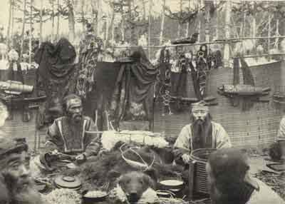

  
[Intangible Textual Heritage](../../index)  [Shamanism](../index) 

------------------------------------------------------------------------

[Buy this Book at
Amazon.com](https://www.amazon.com/exec/obidos/ASIN/B002FL4VJ8/internetsacredte)

------------------------------------------------------------------------

<table width="75%">
<colgroup>
<col style="width: 50%" />
<col style="width: 50%" />
</colgroup>
<tbody>
<tr class="odd">
<td width="50%" data-valign="TOP"></td>
<td width="50%" data-valign="CENTER"><h1 id="shamanism-in-siberia" data-align="CENTER">Shamanism in Siberia</h1>
<h5 id="excerpts-from-aboriginal-siberia" data-align="CENTER">excerpts from Aboriginal Siberia</h5>
<h3 id="by-m.-a.-czaplicka" data-align="CENTER">by M. A. CZAPLICKA</h3>
<h4 id="section" data-align="CENTER">[1914]</h4></td>
</tr>
</tbody>
</table>

------------------------------------------------------------------------

[Contents](#contents)    [Start Reading](sis00)    [Text
\[Zipped\]](sis.txt.gz)

------------------------------------------------------------------------

|                                                                                                                           |
|---------------------------------------------------------------------------------------------------------------------------|
|  |

This is M.A. Czaplicka's review of the literature about Shamanism in
Siberia, excerpted from a longer ethnographic work. Siberian Shamanism
is important topic because the practice continued there up until
historic times, and so there are reliable modern accounts. The details
of the shamanistic journey appear to be largely consistent throughout
this culture region. This extended description contains important source
material on Shamanism.

------------------------------------------------------------------------

 [Title Page](sis00)  

### Part III. Religion

[Chapter VII. Shamanism](sis01)  
[Chapter VIII. The Shaman](sis02)  
[A. The Shaman's Vocation](sis03)  
[B. The Shaman's Preparatory Period](sis04)  
[Chapter IX. Types of Shamans](sis05)  
[Chaper X. The Accessories of the Shaman](sis06)  
[Chapter XI. The Shaman in Action](sis07)  
[Chapter XII. Shamanism and Sex](sis08)  
[Chapter XIII: Gods, Spirits, Soul](sis09)  
[Chapter XIV. Some Ceremonies](sis10)  
