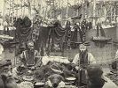

  
[Intangible Textual Heritage](../../index)  [Shamanism](../index) 
[Index](index)  [Previous](sis05)  [Next](sis07) 

------------------------------------------------------------------------

[Buy this Book at
Amazon.com](https://www.amazon.com/exec/obidos/ASIN/B002FL4VJ8/internetsacredte)

------------------------------------------------------------------------

  
*Shamanism in Siberia*, by M.A. Czaplicka, \[1914\], at Intangible
Textual Heritage

------------------------------------------------------------------------

# CHAPTER X

### THE ACCESSORIES OF THE SHAMAN

IN everyday life the shaman is not distinguishable from other people
except by an occasionally haughty manner, but when he is engaged in
communicating with spirits he has to make use of a special dress and
special instruments. Of these the most important and the one in most
general use is the shaman's drum. It may be said that all over Siberia,
where there is a shaman there is also a drum. The drum has the power of
transporting the shaman to the superworld and of evoking spirits by its
sounds.

Authors of the eighteenth century, like Pallas and Krasheninnikoff, pay
great attention to the shaman's accessories. Though they have probably
only been attracted by their picturesque side, yet their descriptions
are very valuable in view of the modern attempt to reach the primitive
mind through its symbolical forms of expression.

Shashkoff \[1\] enumerates the following items as indispensable to the
shaman's dress all over Siberia-the coat, the mask, the cap, and the
copper or iron plate on the breast. The Samoyed *tadibey* substitute for
the mask a handkerchief tied over the eyes, so that they can penetrate
into the spirit-world by their inner sight. This use of a handkerchief
is also mentioned by Wierbicki, who says that the shamans of northern
Altai wear one round the forehead to keep the hair out of the eyes.

These four accessories-the coat, the mask, the cap, and the iron
plate-are used by the Neo-Siberians only, since among Palaeo-Siberians
the dress is much less complicated.

Each tribe has, moreover, some particular object which plays the chief
part in the shamanistic ceremony.

Gmelin,\[2\] describing the Tungus shaman's costume, says that over the
usual shamanistic garment an apron, adorned with iron, is also worn; his
stockings, likewise remarkable, are made of skin

\[1. *Shamanism in Siberia*, p. 86.

2\. *Reise durch Sibirien*, ii, 193.\]

ornamented with iron. Among the Gilyak and the Olchi it is the shaman's
girdle which is of the greatest significance;\[1\] among the
Buryat,\[2\] the horse-staves, &c. Iron and copper objects seem also to
be especially associated with the Neo-Siberians.

The whole costume with its appurtenances used during shamanistic
performances throughout Siberia has, according to Mikhailowski,\[3\] a
threefold significance:

1\. The shaman wishes to make a profound impression on the eyes of the
people by the eccentricity of his costume.

2\. The ringing of the bells and the noise of the drum impress their
sense of hearing.

3\. Finally, a symbolic meaning is attached to these accessories and
adornments, a meaning known only to believers, especially to the
shamans, and closely connected with the religious conceptions of
shamanism.

Thus Mikhailowski. But this interpretation does not bring out the whole
importance of the relation of these objects to the spiritual world. They
are of great importance, for the spirits will not bear the voice of the
shaman unless the right dress and implements are used, and the drum
beaten; they are sacred because of their contact with a supernatural and
often dangerous power.

Being sacred, these accessories must not be used by any one but a
shaman, otherwise they are impotent to produce any result. It is only a
good shaman, a real one, who can possess the full shaman's dress.

Among the Palaeo-Siberians it is usually the shaman himself who makes
all accessories, and that only when the spirits give their permission.
Among the natives of Altai it is not all shamans who have the right to
wear *manyak* (the coat) and the owl-skin cap.\[4\]

Among the Yakut even the blacksmith who undertakes the ornamentation of
the costume, must have inherited the right, 'If the blacksmith who makes
a shamanistic ornament has not a sufficient number of ancestors, if he
is not surrounded on all sides by the noise of hammering and the glow of
fire, then birds with crooked claws and beaks will tear his heart in
pieces.'\[5\] For this

\[1. Schrenck. *The Natives of the Amur Country*, iii, 124-6.

2\. Agapitoff and Khangaloff, *Materials for the Study of Shamanism in
Siberia*, p. 43.

3\. *Shamanism*, p. 72.

4\. Potanin, *Sketches of North-Western Mongolia*, iv, 53.

5\. Sieroszewski, *The Yakut*, p. 632.\]

reason the blacksmith's vocation comes next in importance to the
shaman's. In modern times it is practically impossible among the Yakut
for the shaman's coat to be made, since there is now no class of
hereditary blacksmiths. In his description of the Tungus shaman's
garment, Gmelin relates how the shaman whom he saw bad no cap because
the old one was burnt and the spirits would not grant him a new
one.\[1\] Of the Buryat shamans he observes that many of them do not
possess drums, since the spirits with. bold permission to make them, and
two long sticks which are struck crosswise against each other are
therefore substituted at the performance.\[2\] Mikhailowski quotes the
above statement in explanation of the fact that Khangaloff had seen only
one drum among the Buryat shamans.

'With the degeneration of shamanism', says Mikhailowski, 'the number of
people who know bow to prepare the sacred instrument with due regard to
magical custom is decreasing.' \[3\] This, however, is not the true
explanation of the disappearance of the drum among the Buryat, for the
importance of the other chief Buryat accessory, the horse-staves, which
demand equal care in the making, must also be taken into account.
Without them the shaman cannot perform any of the principal rites. They
are usually made of birch-wood, no one but a shaman who has passed his
fifth consecration being allowed to use iron horse-staves.\[4\] The
Lapps take great care of their drum and keep it covered up with furs. No
woman may touch it.

#### A. Palaeo-Siberians.

The Chukchee. Among Palaeo-Siberians there are no strict regulations as
to the shape and quality of the shaman's dress. Originality of costume
is what is most sought after, and Bogoras tells us that the Chukchee
shamans sometimes adopt some old coat brought froin the American shore.
'The Chukchee have nothing similar to the well-known type of coat
covered with fringes and images, which is in general use among the Yakut
and Tungus, and which probably was borrowed from the latter by the
Yukaghir and perhaps also by the Kamchadal.'\[5\]

The absence of a peculiar shaman's dress among the Chukchee

\[1. Op. cit., P. 193.

2\. These are Probably what are called by later writers 'horse-staves'.

3 Op. cit., p. 68.

4\. Klenientz, *E. R. E.*, p. 16.

5\. The Chukchee, pp. 457-8.\]

may be accounted for by the fact that the shamans perform their
ceremonies in the darkness of the inner room of the house, in an
atmosphere so hot and stifling that they are obliged to take off their
coats and to shamanize with the upper part of the body quite naked.

The only shamanistic garments that Bogoras speaks of are a coat and a
cap. 'As far as I know,' he says, 'among the other neighbouring tribes
also female shamans have no outward distinguishing mark, nor do they use
the special shamanistic garb which is assigned only to the male
shamans.'\[1\]

After this statement the custom among certain tribes of the adoption by
the male shaman of the clothes and manner of a woman appears still more
strange. The shamanistic coat is characterized by a fringe round the
sleeves a little above the opening, or round the neck a little below the
collar. This coat may be adopted by the shaman or by the patient.
Besides the fringe there are slits ornamented with cured leather. 'These
slits and fringes are usually said to represent the curves and zigzags
of the Milky Way.' \[2\]

But if we remember the many other ways in which the Chukchee shaman
imitates the Tungus shaman, we may conclude that both slits and fringes
in the shamanistic coat are but another instance of the same imitation.
The garment represented in Bogoras's book has in front of it an image of
*tetkeyun*, that is, 'vital force', which resides in the heart and
assumes its form. It is made like a leather ball and filled with
reindeer-hair. The other figure, likewise of leather, represents a
*rekken*, or 'assisting' spirit of the shaman.\[3\]

The shamanistic cap is also supplied with fringes, with a tassel on the
top and a long double tassel on the left side. The tassels are of the
type adopted for magic purposes, that is, they are formed of alternating
pieces of white and black fur. 'Another cap with the opening on top, and
likewise fringed and tasselled, was used by the shaman as a remedy
against headache.' \[4\]

In addition to these garments, the Chukchee shaman uses in his
performances many small instruments, such as the knife, the handle, of
which is embellished with magical objects, and a small flat piece of
ivory, which is said to be usually employed when cutting open a body.
The ivory of the shaman, 'Scratching-Woman', had three

\[1. Op. cit., p. 458.

2 Op. cit., p. 459.

3\. Ibid.

4\. Op. cit., p. 460.\]

leather images fastened to it. 'One was said to represent a *kele* from
the "direction" of the darkness, with the arms longer than the legs. The
middle image with only one arm and one leg, and with the two eyes one
above the other, represented the *kele lumetun*. The third image
represented a crawling "spell" sent by an enemy of the shaman, who
interecpted it on the way and thoroughly subdued it so that it began to
do his bidding.'\[1\] These different amulets, the form of pendants and
tassels, are made of skin and beads by the shaman himself, and are
fastened to various parts of the body or dress. Such are also the 'round
patches of skin, often with a tassel in the centre',\[2\] which are
considered highly effective amulets among the Chukchee, the Koryak, and
the Asiatic Eskimo. They are sewn to the coat, on the breast or on the
shoulders, or against the affected part of the body. An image of the
'guardian' is placed in the middle, and is often replaced by an
ornamental figure of a woman, of a dancing man, or of a warrior. These
objects, as well as those already mentioned, serve both a magical and an
ornamental purpose.

The most important object in shamanistic performances all over Siberia
is the drum. Thus the Chukchee use the drum which is common to both
Asiatic and American Eskimo.

The drum used by the Reindeer and Maritime Chukchee is different from
that adopted in north-western Asia by the Yakut, Tungus, Koryak,
Kamchadal, and Yukaghir, which is rather of a southern type.

The southern drum is large and somewhat oval in shape, and is held by
four loose bands, which are fastened to the hoop of the drum on the
inner side. The other ends of these bands meet in the middle, where they
are tied to a small wheel or a cross, which is without any other
support. When these are grasped by the hand the drum hangs loosely, and
may be shaken and its position changed at will. The drum-stick is made
of wood and covered with skin or with cured leather.

The Chukchee drum has a wooden handle\[3\] which is lashed with sinews
to the wooden hoop. The diameter of the hoop, which is nearly circular
in shape, is from 40 to 50 centimetres. The head is made of very thin
skin, usually the dried skin of a walrus's stomach. In order to stretch
the skin it is moistened with water or wine, and the edge is then tied
with sinew cord. The ends of

\[1. Op. cit., p. 466.

2\. Op. cit., p. 468.

3\. According to Mr. Henry Balfour this shows Eskimo influence.\]

this cord are fastened to the handle. The drum is very light weighing
from half a pound to a pound and a half. The drumstick varies according
to its purpose. It is either a narrow, light strip of whalebone from 30
to 40 centimetres long, or a piece of wood from 60 to 70 centimetres
long, which is sometimes adorned with fur tassels. The former is used
during the magical performances held in the inner room at night, the
latter during ceremonials performed in the outer tent during the
day.\[1\]

When the family is moving from place to place, the cover of the drum is
removed, folded, and fastened to the hoop to be replaced when needed. In
the winter house the drum remains in front of the sleeping-place, and in
the summer tent it hangs near the sacred fire-board.

The Koryak. The shaman accessories of the Koryak, another
Palaeo-Siberian tribe, are described by Jochelson as follows: 'The
Koryak shamans have no drums of their own; they use the drums belonging
to the family in whose house the shamanistic performance takes place. It
seems that they wear no special dress; at least the shamans whom I had
occasion to observe wore ordinary clothing.'\[2\]

One embroidered jacket. which was sold to Jochelson as an Alutor
shaman's dress, is very much like the ordinary man's dancing-jacket used
during the whale ceremony, but more elaborate. The Koryak drum belongs
not to the shaman but to the family. It is used both as a musical
instrument and as a sacred object in the household. Everybody who
pleases can beat the drum, but there is usually one competent person who
knows bow to shamanize with it.

The Koryak drum, *yyai*, is oval in shape and covered with reindeer-hide
on one side only, its diameter being 73 centimetres. The drum-stick is
made of thick whalebone, wider at the end with which the drum is struck,
and this end is covered with the skin of a wolf's tail.

Inside the drum at four points in the rim a double cord of nettle fibre
is fastened and joined below to form the handle. These cords run towards
one side of the drum. On the top of the inside rim is attached an iron
rattle. Jochelson says that this custom of attaching the rattle has been
borrowed from the Tungus and that not all Koryak drums possess it.\[3\]

\[1. Bogoras, *The Chukchee*, pp. 356-7.

2\. The Koryak, pp. 54-5.

3\. Op. cit. P. 56\]

The Kamchadal (Itelmen). Among the Kamchadal there is apparently no
shamanistic garment or drum. Two early travellers to their country,
Steller and Krasheninnikoff, say that everybody, especially women, could
shamanize, and hence this occupation was not professional enough to
demand a special dress.

The Yukaghir. The Yukaghir drum is a rough oval. It is covered with hide
on one side only. Inside the drum there is an iron cross near the
centre, which serves as a handle. The ends of the cross are fastened
with straps to the rim, to which four iron rattles are attached.\[1\]
There is a great similarity between the Yukaghir and the Yakut drum, not
only in the iron rattles, iron cross, and general shape, but also in the
small protuberances on the outer surface of the rim, which according to
the Yakut represent the horns of the shaman's spirits. The stick is
covered with the skin of a reindeer's leg. In Yukaghir traditions the
drum without metallic additions is still traceable, the iron pieces
having been borrowed from the Yakut.

The Yukaghir word for drum is *yalgil*, which means 'lake', that is, the
lake into which the shaman dives in order to descend into the
shadow-world.\[2\]

The Eskimo. This is very much like the conception of the Eskimo, the
souls of whose shamans descend into the lower world of the goddess
Sedna. The Eskimo drums are not large; the largest are to be found at
Hudson Bay. They are either symmetrically oval or round, and a wooden
handle is fastened to the rim. J. Murdoch\[3\], says that such drums are
used by the Eskimo from Greenland to Siberia. The Eskimo as well as the
Chukchee beat the lower part of the drum with the stick. The Koryak drum
also is struck from below, and is held in a slanting position. Other
Asiatic drums are mostly beaten in the centre. Among the Indians living
south of the Eskimo we find broad-rimmed drums used for purposes of
shamanism, as well as in dancing-houses.\[4\]

The Gilyak. The most important accessories of the Gilyak shaman are the
drum, *kas*, and the shaman's girdle, *yangpa*. Schrenck gives us the
following description of them: 'One night when I was sitting in a tent
in the village of Yrri, they brought in two shamans' drums and other
accessories, and at my request

\[1. Ibid.

2\. Op. cit., P. 59.

3\. *A Point Barrow Eskimo*, 1887-8, p. 385.

4\. Jochelson, The, Koryak, p. 58.\]

they allowed me to be present at the preparation for the ceremony, First
of all the drum was heated by the fire, to make the hide taut, so that
the sound might be more sonorous.\[1\] The drum was made of the skin of
a goat or reindeer, and whilst it was being prepared the shaman made
ready. He took off his outer garment, put on the so-called *koska*, a
short apron, and tied round his head a band of grass, the end of which
hung over his shoulders like a tress of hair. Then he took the shaman's
leather girdle, with many iron plates,\[2\] copper hoops, and other
metal pendants, which produce a loud clanking noise during the
shamanistic dances.' This girdle is called in Olcha dialect *yangpa*.
Its chief pendant is a large copper disk with a small handle ornamented
in relief, showing Manchu influence; this circle, called *tole*, makes
the most important sound. There are also many iron links called *tasso*,
and many irregular pieces of iron called *kyire*, which make a very loud
noise; a few rolled iron plates called *kongoro*, and, finally, some
small copper bells without tongues, called *kongokto*. When the girdle
is put on all these objects hang together at the back. This shamanistic
girdle is of considerable weight.\[3\]

Although the Gilyak belong to the Palaeo- Siberians, the metal
accessories seem to be of Tungus origin, as are some other features of
their culture. We read in Gmelin's \[4\] description of the costume of a
Tungus shaman that he wears over the ordinary dress an apron ornamented
with iron. This suggests that this apron-form of the shaman's coat was
borrowed either by the Gilyak from the Tungus, or vice versa.

#### B. The Neo-Siberians.

Among the Neo-Siberians all their philosophy of life is represented
symbolically in the drum, and great significance is also attached to
various parts of their dress.

The Yakut. Among the Yakut even those who, like the blacksmith, help in
the adornment of the shaman's garment, occupy a half-magical position,
being credited with 'peculiar fingers '. \[5\] The hereditary
blacksmiths have tools with ' souls', *ichchylakh*, which can give out
sounds of their own accord. The blacksmiths

\[1. Exactly the same preparations are mentioned by Jochelson, *The
Koryak*, p. 56.

2\. Compare the leather apron hung with jingling iron pieces worn by
Manchu shamans. \[Suggestion of Mr. Henry Balfour.\]

3\. Schrenck, op. cit., iii. 126.

4\. Op. cit., p. 193.

Sieroszewski, *The Yakut*, p. 632.\]

are those who approach most nearly to the shaman in their office, and
are, in a way, related to them. 'The blacksmith and the shaman are of
one nest', says a proverb of the Kolyma district, cited by Sieroszewski.
'The smith is the elder brother of the shaman' is another saying quoted
by Troshchanski. Blacksmiths can sometimes cure, give advice, and
foretell the future, but their knowledge is simply a matter of
cleverness and does not possess magical value. The profession of
blacksmith is mostly hereditary, especially in the north; in the ninth
generation the blacksmith first acquires certain supernatural qualities,
and the longer his line of descent, the greater his qualities. The
spirits are generally afraid of the iron hoops and of the noise made by
the smith's bellows. In the district of Kolyma the shaman would not
shamanize until Sieroszewski had removed his case of metal instruments,
and even then attributed his bad luck to them: 'The spirits are afraid
of the blacksmith (Sieroszewski), and that is why they do not appear at
my call.'\[1\]

The shaman's dress, according to Sieroszewski, consists chiefly of a
coat. It is of cowhide, so short in front that it does not reach the
knees, but touching the ground at the back. The edges and the surface of
this coat are ornamented at the back with different objects, each having
its own name, place, and meaning. The shaman's coat, which is not an
indispensable part of the ritual costume arnong Palaeo-Siberians, is
most elaborate among the Neo-Siberians.

Linguistically also there is a curious point connected with the terms
for coat and drum. While the drum has a common name (with dialectic
differences) among most Neo-Siberians, *tünür*, *tüngür*, &c., the term
for the shaman's coat varies: *kumu, ereni, manyak*.\[2\] This seems to
show that the ceremonial coat is a comparatively newer invention than
the ceremonial drum.\[3\]

Sieroszewski \[4\] gives us an account of the meaning of the coat
ornamentation, which he heard from in old Yakut. It is as follows:

1\. *Küngeta* (the sun), a round, smooth, shining disk, the size of a
small saucer, hanging between. the shoulders, on a short strap of
leather which passes through the hole in the middle of the disk. \[5\]

\[1. lbid.

2\. Wierbicki, *Altaian Dictionary*, p. 487.

3\. Troshchanski, op. cit., P. 131.

4\. Sieroszewski, op. cit., p. 632.

5\. Troshchanski (p. 143) says that according to Piekarski there is no
such word is *küngeta*; it is, be says, *künäsä*, or *küsänä*, but the
meaning of *künäsä* is uncertain. However, Troshchanski thinks that the
Yakut word *kün*-sun'--is not etymologically connected with *künäsä*.
Khudyakoff translates the Yakut word *küsänä* as'bell'. According to
Katanoff, *küsänä* means (1) 'oracular time' (?), or (2) 'iron circle'
fastened to the shaman's coat and representing the sun.\]

2\. *Oibon-Künga* (hole-in-the-ice sun), a disk of the same shape and
size as the first, but with a larger hole in the middle. it hangs above
or below the first plate on a long leather strap.\[1\]

3\. *Kondei kyhan*, rolls of tin about the size of a thumb, but longer,
banging at the back on the metal rings or loops.

4\. *Chilliryt kyhan*, flat plates as long as fingers, banging in great
numbers at the back, above the waist.

5\. .*Hobo*, copper bells without tongues, suspended below the collar;
like a crow's egg in size and shape and having on the tipper part a
drawing of a fish's head. They are tied to the leather straps or to the
metal loops.

6\. *Biirgüne*, two round flat disks, similar to those which adorn the
woman's cap, *tuskata*, but without any design on them; they are tied
like an epaulet on the shaman's shoulders.

7\. *Oiogos timiria*, two plates about the breadth of four fingers and a
little shorter, fastened on both sides of the body.

8\. *Tabytaua*, two long plates two fingers broad, which are fastened to
both sleeves.

9\. *Ämägyat, abagyta ämätiat* (in many places called *emchet*), a
copper plate as long as the first finger and half as wide as the palm of
the hand. It is covered either with a drawing of a man, 'with feet,
bands, head, nose, mouth, eyes, and ears',\[2\] or with an engraving in
relief on a copper medallion, having a man's figure in the middle.

'Only a blacksmith who has nine generations behind him can,

\[1. Troshchanski (p. 144) converts this term into *oibon-künäsätä*
(hole-in-the-ice circle). *Künäsätä* is the genitive of *künäsä*; the
genitive form is used to show that these objects belong to the shaman's
coal. Priklonski (*Three Years in the Yakutsk Territory*, 1891, p. 54)
calls it *külar-küsanat* (happy, joyous sun), which, according to
Troshchanski (p. 144), is also wrong. He says it ought to be *külär
küsänä* (laughing circle). Potanin (op. cit., iv. 51) states that among
the Mongols Of north-western Asia, there are sewn on the back of the
shaman's coat two round copper disks, called by the Altaians *kusungy*,
or *kuler-kusungy*, and sometimes two others on the breasts. Tretyakoff
(op. cit., p. 214) informs us that the shamans of Dolgan have a disk
hanging on the breast, which represents the chief evil spirit called
*kuganna*, Troshchanski (op. cit., p. 145), however, suggests that
*kuganna* is simply the Yakut *küsänä*, and is not a term for an evil
spirit, but for the disk.

2\. Sieroszewski quotes a native description of it, op. cit., p. 634.\]

without danger to himself from the spirits, make an *ämägyat*, a copper
plate such as has been described, which the shaman, when he begins to
shamanize, hangs on his breast.'\[1\] What exactly *ämägyat* means,
whether it is a personal or an impersonal power, it is difficult to
determine. We shall go on to review the various references to this
subject, since the word *ämägyat* is used in the double sense of (1) an
invisible power and (2) of a visible symbol. In this chapter we shall
confine ourselves to the latter. The absence of *ämägyat* differentiates
the less important shamans, called *kenniki oyuun*, from those who
possess it and who are known as *orto oyaun*. The power of those in
partial possession of *ämägyat* varies according to 'the strength of
their *ämägyat*'\[2\] The great shamans are those whose
'spirit-protector was sent them by Ulu-Toyen himself' (*ämägyatitiah
ulytoër ulutoënton ongorulah*).\[3\]

Describing the shaman in action, Sieroszewski4 says that the shaman
implores the assistance of his *ämägyat* and of other protecting
spirits'; and it is only when the *ämägyat* descends upon the shaman
that he begins his frenzied dances.  
Whenever a family numbers a shaman among its members, it continues to do
so, for after his death the *ämägyat* seeks to re-embody itself in some
one belonging to the same clan (*aya-usa*).\[5\]

'*Ämägyat* ', says Sieroszewski in another place,\[6\] is a being quite
apart; in most cases it is the soul of a departed shaman; sometimes it
is one of the secondary supreme beings.'

The human body cannot endure the continuous presence of a power equal to
that of the great gods; hence this spirit-protector (if *ämägyat* can be
so called) resides not within, but close beside the shaman, and comes to
his assistance at critical moments, or whenever he needs him.\[7\]

The shaman can see and hear only with the help of his *ämägyat* said the
shaman Tiuspiut to Sieroszewski.

Possession of the *ämägyat* does not in any way depend upon the shaman;
it comes either by an accident or by a decree from above. Tiuspiut
obtained his *ämägyat* (of Tungus origin) quite accidentally.

The great shamans at death take their *ämägyat* with them, and thus
change into heavenly beings, most of whom are ex-shamans;

\[1. Op. cit., p. 632.

2\. Op. cit., p. 628.

3 Ibid.

4\. Op. cit., pp. 642-3.

5\. Op. cit., p. 625.

6\. Op. cit., p. 626.

7 Op. cit., p. 627.

8\. Ibid.\]

if the *ämägyat* does not depart in this way, then sooner or later it
will show itself on the earth.  
Troshchanski says that the most important ornament of the Yakut shaman's
coat is *ämägyat*, which represents a man. On one of the coats that he
reproduces there is an *ämägyat* on the left side made of molten copper.
On another coat *ämägyat* were op. both sides of the breast and made of
tin.\[1\]

Ämägyat is the sign of the shaman's vocation, which is always given by
the old shaman to the new. It is quite possible, thinks Troshchanski,
that it represents the shaman's ancestor and protector.\[2\]

Speaking of the preparatory stage of the shaman, Troshchanski says that
the Yakut shaman is taught by an older shaman, who initiates him by
suspending round his neck the *ämägyat*. This symbol is taken away from
the shaman who no longer wishes to shamanize. An old blind Yakut,
however, told Sieroszewski (p. 625) how he gave up his shaman's
vocation, thinking it a sin, and although a powerful shaman removed the
*ämägyat* sign from him, nevertheless the spirits made him blind.

In the Mongolian language *ämägäldzi* signifies the figure of the
protective genius of the house, family, and goods, and is made of tin.
According to Katanoff, this word is derived from ämägän, grandmother.

10\. *Balyk-timir* (the fish), a plate a metre long, two fingers wide,
made in the form of a fish with head, fins, tail, and scales. It bangs
on a long leather strap. In some places, like the district of Kolyma, it
drags on the ground to entice the secondary spirits, which run after it
and try to catch it.\[4\]

11\. *Choran*, small hollow copper balls, fastened to the ends of long
leather straps reaching to the heels and banging like a fringe from the
lower edge of the coat. This fringe is called *bytyrys* (the weed).

The coat is plain in front, and fastens on the breast with leather
straps, and under the chin with a buckle in the form of a colt's tongue
(*kulun tyl kurduk*). On the front of the coat are sewn figures of
animals, birds, fishes; various disks; images of the sun, moon, and
stars; and also some iron representations of the human skeleton and
bowels.

In the north, in case of the absence of this costume, the shaman

\[1. Troshchanpki, op. cit., p. 140.

2\. Ibid.

3\. Op. cit., p. 147.

4\. Sieroszewski, p. 634.\]

wears the woman's *sangyniah*, a coat of calf's skin, with the hair
outside, on the feet of which are occasionally hung some of the most
important iron accessories, like the two 'suns' (or sun and moon), the
fish and the *bürgüne*; sometimes two round circles, which represent the
breasts, are hung in the front.

A good shaman's dress requires about 35 to 40 pounds of iron.

In the north the shaman wears a woman's travelling cap with ear-flaps,
but this is not to be seen in more southern regions, where the shaman is
in most cases bareheaded.

According to general belief, the iron and the jingling pendants of the
shaman's coat have the power to resist rust, and possess a
soul-*ichchite*.\[1\]

The shaman wears his magical coat next his skin, and receives it from
the hand of a *kuluruksuta* (page, assistant), i. e. the man whose duty
it is to shout during the performance: *seb! kirdik! choo! o o!* ('well!
true! choo! o o!'), and who helps the shaman in other ways, such as
preparing the drum.

The Yakut drum is called, according to Sieroszewski, tüngür,\[2\] and
according to Troshchanski,\[3\] *tünür* or *dünür*.

The drum is always egg-shaped, and is covered with the bide of a young
bull. Its longest diameter is 53 cm., the width of the rim 11 cm., and
the length of the stick 32 cm. The wider part of the stick is covered
with cowhide. According to Jochelson, there are twelve raised
representations of horns on the drum.\[4\] Sieroszewski \[5\] says that
they are always found in odd numbers, 7, 9, or 11. The cross inside is
attached to the rim by means of straps. Little bells, jingling trinkets,
and other rattles of iron and bone are attached inside round the rim,
especially in the places where the straps are fastened.

The term *tüngür*- seems to be a universal name for the drum among most
of the Neo-Siberian tribes; sometimes *t* changes to *d*, giving the
form *düngür*.

In Manchu the drum is called *tunkun*; in Mongol *düngür*; in Altaian
tüngur; in Uriankhai *donkür*; in Soïot and Karagass *tüngur*.

Among the Yakut, as has been said, there are two names, *tünür* and
*donkür*. Maak\[5\] records that the Yakut of Viluy

\[1. Sieroszewski, op. cit., p. 635.

2\. Op. cit., p. 635.

3\. Op. cit., p. 128.

4\. *The Koryak*, pp. 56-7.

5\. Sieroszewski, p. 635.

6\. *The Viluysk District of the Yakusk Territory*, iii. 118.\]

explained to him that 'the shamans in addition to the tünür (drum) have
also a stringed instrument, *dünür*.

The word *tünür* among the Yakut means also kinship through marriage:
*tünürätär*, 'match-making'.

Troshchanski\[1\] thinks that this double meaning is not accidental, and
that as the shaman was originally the head of a family, the drum might
be regarded as the bond of unity between the shaman and the community,
as well as between the shaman and the spirits.

Besides the drum, the shaman uses two other musical instruments, one of
which is a stringed instrument like the Russian balalaika (a kind of
banjo), the other an instrument like that known as a jews' harp, a small
frame with a long wooden or metal tongue, which is moved by the finger;
the narrow end of the instrument is held between the teeth, so that the
mouth acts as a sounding-board.

Among the Yakut the jews' harp, called *homus* (*hamys*), is apparently
not a shaman's instrument, though the shamans of other Neo-Siberians
have been known to use it.

Among the Buryat from Irkutsk, this instrument is called *khur*, and is
used only by the shamans.\[2\] This is also true of the Uriankhai. The
Soïot call it *komus*, but the Altaians (using the term in the narrowest
sense), who also have the word *komus*, use it to designate the stringed
instrument resembling the Russian balalaika, which only shamans
play.\[3\] The Kirgis call the shaman's drum *kobuz*.\[4\] According to
Wierbicki, the Altaians use the two-stringed *kabys* or *komus* as an
accompaniment to the recital of heroic tales.\[5\]

There are sometimes minor shamanistic performances without the drum and
without the special garments. The shaman sits in his everyday dress on a
small chair in the middle of the room and holds in his bands a branch
ornamented with bunches of white horsehair, of which there may be three,
five, or seven, but never an even number. The fire is not put out for
these performances, and some of the horsehair is thrown on to it. The
shaman does not dance, but sings and whirls about.\[6\]

\[1. Op. cit., p. 129.

2\. Katanoff, *A Journey to Karagass in 1890*, I.R.G.S., 1891, p. 201.

3\. Wierbicki, *A Dictionary of the Turkic Language*, p. 141.

4\. Troshchanski, p. 130.

5\. *The Natives of the, Altai*, p. 139.

5\. Sieroszewski, op. cit., p. 635.\]

Troshchanski \[1\] thinks that, among the Yakut, white and black shamans
have different coats. The coat of the white shaman has no animal
pictures on it, because their spirit-protectors belong to the *aiy*
(good spirits), which are not symbolized by animal pictures. The coat of
the black shaman should not (according to Troshchanski) have
representations of the sun, for these are peculiar to white shamans. The
drums of the two shamans also differ. When Troshchanski showed an old
Yakut woman, who knew a great deal about the shaman dress, a certain
drum (op. cit., fig. II, *b*), she at once recognized it as a white
shaman drum, since horsehair was fastened round the iron rim inside
it.\]

Tribal and clan differences exist in the shaman's coat, and it would be
difficult to say whether a sharp line can be drawn between black and
white shamanistic garments. Troshchanski is much influenced by this
conception of dualism, but from the materials in our possession, a few
very imperfect photographs, it would be unwise to come to a decision. It
should be remarked, however, that neither of the writers on the
Palaeo-Siberians in describing shaman instruments makes this division,
and but few of the writers on the Neo-Siberians.

Potanin \[2\] describes how, on a shaman's coat of the Uriankhai tribe,
among other properties, there was a small doll with a minute drum in its
left hand. On the same string to which the doll was tied there was
another small figure of an animal resembling the sacrificial animal of
the real shaman. The significance of this is, of course, obvious. The
shaman's ancestor resides in a symbolic form in the shaman's coat. Thus
the small doll of the Uriankhai shaman's coat takes the place of the
*ämägyat* the Yakut, if we are to take *ämägyat* as the symbol of the
shaman's ancestor.

The skeleton figuring on the shaman's coat in Troshchanski's book must
probably also be ascribed to the shaman's ancestor, for quite near it
are sewed hawks' wings, and none but a shaman can fly or be represented
by wings.

One might suppose from what has been said above that we have here to
deal with three ways of representing the shaman ancestor: by the doll,
the ämägyat, and the skeleton. It would be interesting to know, however,
whether or not the ämägyat is to be found side by side with either of
the other symbols. If so, it

\[1. Op. cit., p. 133.

2\. Op. cit., iv. 100.\]

is possible that ämägyat is not a symbol of the ancestor spirit, but has
a meaning of its own. On the Yakut coat the skeleton exists independent
of ämägyat. On the Altaian coats described by Potanin, the doll is found
side by side with the ämägyat. Both Troshchanski and Sieroszewski
describe ämägyat as an indispensable ornament of every shaman's coat.

The coat possesses an impersonal power of itself. It is said to bear the
names of *ongor* (Mongol) and *tanara* (Yakut) in addition to the
classified names for the coat.

By assuming this coat the shaman receives supernatural power, which
allows him to go to the upper- and under-worlds to meet spirits and deal
with them. It is called 'shaman's horse' among the Yakut.

The coat as a whole is a *tanara* of the shaman, and each symbolic
picture on the coat is also his *tanara*, i.e. protector.\[1\]

Another interpretation of the coat is given by Pripuzoff.\[2\] The
picture of a perforated sun and a half-moon, he says, represents the
dusk which reigns in the kingdom of the spirits. The strange animals,
fishes, and birds which hang on the coat point to the monsters that are
said to inhabit the spirit-land.

The iron chain hanging on the back signifies, according to some, the
strength of the shaman's power, and according to others, the rudder
which he uses in his journeys through the spirit country. The iron disks
are there to defend the shaman from the blows of the hostile spirits.

Potanin\[3\], gives us an interesting description of the shaman's
garment among the natives of Altai and north-western Siberia. According
to him, it is in comparatively good preservation among the natives of
Altai.

Natives of Altai. The shaman's coat is made of goat or reindeer hide.
All the outer side is covered with pendants of varying length in serpent
form, and has pieces of many-coloured stuff stitched on to it. The
pendants, which terminate in serpents' heads, hang freely. Bundles of
reindeer leather straps are also attached here and there. The term
*manyak*, is applied by the natives of Altai to the small pendants as
well as to the coat as a whole.

There can further be found on the coat various symbolic figures and
jingling pendants, such is iron triangles, a small bow and

\[1. Troshchanski, p. 135.

2\. p. 95.

3\. Op. cit., iv. 49-54.\]

arrow to frighten hostile spirits, &c. On the back and sometimes on the
front of the coat there are sewed two copper disks. One *kam* (shaman)
had four empty tobacco-bags hanging on his coat with imaginary tobacco
inside, which he offers to the spirits whilst he is wandering in their
country.

The collar is trimmed with owl's feathers. One *kam* had, according to
Potanin, seven little dolls on his collar, which, Potanin was told, were
heavenly maidens.

A few bells are sewed on here and there; the more prosperous shamans
have -is many as nine. The ringing of the bells, a *kam* told Potanin,
is the voice of the seven maidens whose symbols are sewed to the collar
calling to the spirits to descend to them.

The cap \[1\] of the Altaian shaman is formed of a square piece of the
hide of a reindeer calf. On one side there are two buttons and on the
other two loops. On the top, bunches of feathers are sewed, and from the
lower edge bangs a fringe made of string and shell-fish. This is placed
on the head with the two sides buttoned to the back, thus forming a
cylindrical cap on the shaman's head. If the hide is bard, the top of
the cap with its feathers sticks up like a coronet.

Among some shamans of the Teleut, the cap is made of brown owl skin; the
feathers remain as ornaments, and sometimes also the bird's head.

It is not all shamans who can wear the *manyak* and the owlskin cap. The
spirits generally announce to the chosen man when he may wear them.

Among the Tartars of Chern the shaman wears a mask (*kocho*), with
squirrels' tails for eyebrows and moustaches. Among the same people
Yadrintzeff noticed the use of two crutches; one of them was a crook,
the other was supposed to be a horse, similar to the horse-staves of the
Buryat.

All the drums which Potanin saw among the natives of Altai and
north-western Mongolia were round in shape.\[2\] Yadrintzeff says that
the Tartars of Chern have oval drums resembling the egg-shaped drum of
the east Siberians.

The Altai drum has a hoop as large as the palm of one's hand, covered on
one side with bide. Inside the drum there is vertical wooden stick and a
horizontal iron *chord* with rattles

\[1. Op. cit., p. 52.

2\. Op. cit., iv. 44, 679.\]

attached. The drum is held by the wooden stick, and not at the
intersection of the stick and the iron crossbar.

The wooden vertical stick is called *bar* by the natives of Altai. Among
other north-western tribes it has various names. The *bar* has a man's
head and feet at the two ends. The upper part is often carved, the eyes,
the nose, the mouth, and the chin being cut with great exactness. The
horizontal iron stay is called by the Altaians *krish*, and from it hang
various iron rattles called *kungru*. The number of *kungru* varies
according to the ability of the shaman. It is a guide to the quantity of
*chayu* (Potanin translates this word 'spirits', but it seems rather to
mean 'spiritual power) possessed by the shaman, since the more *chayu*
the shaman possesses, the more *kungru* are found in his drum.

Under the chin of the figure on the wooden bar are fastened long strips
of gaudy material called *yauasua*. Radloff\[1\] calls this *yalama*.

On the hide of the drum, sometimes on both sides, sometimes on the inner
side only, circles and crosses and other lines are drawn with red
dye.\[2\]

Some Altai drums have drawings of animals on them, lilce those on the
drums of the North-American Indians.\[3\]

The drums of the Chern and Kumandinsk Tartars differ from those of the
Altaians; instead of *bar*, *krish*, and jingling plates there are here
representations of the two worlds, above and underground, separated by a
horizontal line, which divides the drum into two parts, an upper and a
lower.\[4\]

On the outer side of the drum of the Chern Tartars, pictures of animals
and plants are found. On the upper and larger part an arch is drawn,
with indications of sky, inside of which are two trees with a bird on
each. To the left of the tree are two circles-the sun and the moon-light
and darkness. Below the horizontal line are pictures of frogs, lizards,
and snakes.\[5\] These drawings have a particular importance, since the
symbols described show more than any others the shamanistic view of the
natural and the supernatural.

There is unfortunately very little material of a reliable character, the
studies of Potanin and Klementz being the most valuable. On the whole,
it is safe to say that the drums of the natives of

\[1. *Aus Sibirien*, ii. 18.

2 Potanin, iv. 40-9.

3\. Jochelson *The Koryak*, i. 58-9.

4\. Potanin, op. cit., iv. 680.

5\. Op. cit., iv. 44-5.\]

north-west Asia, especially in the southern parts, are adorned with
representations of the upper and lower worlds divided by a horizontal
line.\[1\]

The following interpretation of this same ornamentation is given by
Klementz in his study of the drums peculiar to the neighbourhood of
Minussinsk.\[2\] His information was given him by a *kam* of high
standing.

Although by no means all drums are ornamented in the same way, yet in
this account we may perceive certain traditional rules embodying the
Altaian and Mongolian conception of the meaning of the drum and its
decoration.

A. The lower part of the drum:

1\. *Bai-Kazyn* (painted in white), 'a rich birch' -alluding to the
birches round which annual sacrificial ceremonies are held.

2\. *Ulug-bai-kazyn* (in white)-two trees growing in Ulukhan's country.

3 and 4. *Ak-baga* ('white frog') and *Kara-baga* ('black frog'), the
servants of *Ulu-khan*.

5\. *Chshity-us*, spirits associated with seven nests and seven
feathers.

6\. *Chshity-kyz* ('seven maids'); these bring seven diseases on man.

7\. *Ulugere*, to whom prayers are offered for the curing of toothache
and of earache.

8\. *Ot-imeze* ('Mother of the fire').

B. The upper part of the drum:

1\. *Souban-ir*. The *kam* translated this 'aurora' (whether with the
meaning of dawn or the aurora borealis is impossible to decide from
Potanin's description).

2\. *Ike-karagus*, two black birds, flying as messengers from the shaman
to the *shaytans*.

4\. *Aba-tyus* (the bear's tooth).

5\. *Sugyznym-karagat*. According to the *kam*, this means 'the horses
of Ulu-khan'.

6\. *Kyzyl-kikh-kahn*. to whom one prays when beginning any undertaking.

The other figures drawn in white paint are animals, which
Kyzvl-kikh-khan is hunting.

\[1. Mikhailowski, p. 68.

2\. *Types of Drums of the Minitssinsk Natives*, E. S. S. I. R. G. S.,
p. 26.\]

Many other authors also coniniont on this method of dividing the
pictures on the Neo-Siberian drum. Wierbicki,\[1\] describing the
*tüngür* of the natives of Altai, says: 'On the outer side the hide is
painted with red ochre; on the upper part are represented the sky, a
rainbow, sun, moon, stars, horses, geese, the *kam* on a horse, and, on
the lower part, the earth.'

According to Dr. Finsch's description \[2\] the drums of the Samoyed and
of the Ob-Ostyak are, like the Altai drums, round in shape,
broad-rimined, covered on one side only, and have a diameter of from 30
cm. to 50 cm.

The Ostyak drums described by Potanin \[3\] have the same division of
the drum into lower and upper parts representing lower and tipper
worlds, as among the Tartars of Chern.

The Buryat. The Buryat shaman's costume was first described by
Pallas.\[4\] It belonged to a female shaman, who was accompanied by her
husband and two other Buryat, each of them holding a magical drum.\[5\]
She herself held in her hand two sticks, ornamented at the top end with
a carving of a horse's head surrounded by small bells. \[This implement
is called by recent travellers 'horse-staves'.\] From the back of the
shoulders reaching to the ground hung about thirty snakes, made of white
and black skin, in such a way that the snakes seem to be composed of
white and black rings. One of the snakes was divided into three at the
end, and was accounted indispensable to each Buryat female shaman. The
cap was covered with an iron casque having horns with three branches,
projecting on both sides like those of a deer.

Gmelin\[5\], saw a costume of another old and revered female

\[1. The Natives of the Altai, p. 45.

2\. Finsch, *Reise nach West-Sibirien*, p. 550 (Berlin, 1879), quoted hy
Jochelson, *The Koryak*. p. 59.

3\. Op. cit., iv. 680.  
4. *Reise durch verschiedene Provinzen des russichen Reiches*, 1777,
pp.102-3.

5\. The more recent accounts deny the existence of the drum among the
Buryat. Khangaloff saw it only once, and this was in the case of a young
and inexperienced shaman. Klementz states that the drum is very seldom
in use among the Buryat. Nevertheless he says: 'At great shaman
ceremonies, in which a shaman and his nine sons take part (some of which
the writer witnessed on the estuary of the river Selenga, among the
Kuda, Buryat), one of the assistants holds in his hands a small
tambourine, but neither the meaning of the tambourine nor the róle of
the assistant is quite clear.' Curiously enough, Pallas, writing in the
eighteenth century, agrees with the contemporary witness in describing
the assistants' use of the drum.

6\. ii. 11-13.\]

shaman near Selenginsk. Her costume was hanging in her *yurta*, but,
according to her account, was not complete. Among other things he
mentions a box, full of strips of cloth, small stones, thunderbolts,
&c., which she used for magical purposes.\[1\] There was also a felt bag
full of various felt idols.

In the exhaustive work of Agapitoff and Khangaloff there is a
description of the old shaman costume among the Buryat-a costume of a
kind which, however, is very rarely to be met with at present. According
to them, the coat (*orgoy*), the cap, and the horse-staves
(morini-khörbö are the chief appurtenances of a shaman.

1\. The *orgoy* is of white material for the white shaman, and of blue
for the black shaman. Its shape does not differ from that of the
ordinary coat.'

Klementz\[2\]says that the old-fashioned *orgoy* was shorter than that
of the present day.  
The front of the coat is covered with metal figures of horses, fishes,
birds, &c. The back is covered with twisted iron representing snakes,
-with rattles hanging from them (*shamshorgo*),\[4\] together with a
whole row of little bells and tambourine bells.

On the chest above the thin plates used to hang little shining copper
disks, and on the sleeves were also hung thin iron plates, in imitation
of the bones of the shoulder and forearm. This gave Gmelin the ground
for his assertion that two shamans who came to him from Nijine-Udinsk
resembled chained devils.\[5\]

2\. The cap, which is peaked, is made of lynx skin, with a bunch of
ribbons on the top. After the fifth consecration the shaman can wear the
iron cap; it is composed of a crown-like iron hoop with two half-hoops
crossing each other, above which is an iron plate with two born-like
projections.

In the place where the intersecting hoops are tied to the hoop round the
head there are three groups of *khoubokho*,\[6\] or *kholbogo*, conical
weights of iron. From the back of the hoop hangs an iron

\[1. Agapitoff and Khangaloff (pp. 42-4) call an identical box *shire*.

2\. Agapitoff and Khangaloff, p. 42.

3\. *E. R. E.*, p. 16.

4\. Klementz uses the same native word *shamshoryo* for (i) the rattles
attached to the snakes on the shaman's coat, and (ii) for the conical
iron weights fixed to the upper part of the horse-staves, but he does
not intimate whether this word has two meanings or not.

5\. Klementz states that the *orgoy* is in some places now only put on
after death, for burial.

6\. Klementz calls them *shamshorgo*, E. R E., p. 16.\]

chain composed of four links and ending in small objects resembling a
spoon and an awl.\[1\]

Klementz \[2\] calls this cap the metal diadem, 'consisting of an iron
ring with two convex arches, also of iron, crossing one another at right
angles, and with a long jointed chain which hangs down from the nape of
the neck to the heels-we know of them only from the descriptions of
travellers and from specimens preserved in a few museums'.

3\. The horse-staves (*morini-khorbo*) are to be met with among all the
Buryat of Baikal, but among the Buryat of Balagan they are not used.
Each Baikal shaman possesses two. They are made of wood or of iron; but
the iron staff is only given to the shaman after the fifth consecration,
when he also receives the iron cap. The wooden horse-staves are cut for
the novice the day before his first consecration, from a birch-tree
growing in the forest where the shamans are buried. The wood for the
horse-staves must be cut in such a way that the tree shall not perish,
otherwise it would be a bad omen for the shaman.

This implement is 80 cm. long; the upper part is bent and has a
horse-head carved on it; the middle part of the stick forms the
knee-joints of the horse, and the lower end is fashioned into a hoof.

Little bells, one of which is larger than the rest, are tied to the
horse-staves. Likewise small conical weights of iron, *khoubokho*, or
*kholbogo*, blue, white, yellow and red-coloured ribbons, and strips of
ermine and squirrel fur. To make it look more realistic miniature
stirrups are also attached.

The iron horse-staves are not very different from the wooden ones. They
represent the horses on which the shaman rides to the upper and lower
worlds.

According to Khangaloff, it is in the drum that the horse, on which the
shaman makes his flight, is symbolized. Khangaloff, however, also speaks
of the rarity of the drum among the Buryat. The only drum which he saw
among them was of the form and size of a small sieve, and was covered
with horse-hide fastened to the back with leather straps. He did not
notice any pictures either on the outside or on the inside, but the
outside surface, he says, was daubed with some white stuff.\[3\]

\[1. Agapitoff and Khangaloff, op. cit., pp. 43-4.

2\. *E. R E.*, p. 16.

3\. Agapitoff and Khangaloff, op. cit., pp. 42-4.\]

Klenientz says that the drum, *khese*, is very little known among the
Buryat, who substitute the horse-staves for it, and that the little bell
is sometimes also called *khese*; nevertheless, among the Mongol
Shamanists and the Mongolized Uriankhai, the drum is in use.\[1\]

The Buryat Buddhists use in their divine services either drums covered
on both sides with hide, like those found among the North-American
Indians, or those with hide on one side only. These drums are round, and
have leather handles attached to the outer edge of the rim.\[2\]

Klementz mentions as the next accessory of the shaman the *khur*, a
'tuning-fork'('jews' liarp'?), with a wire tongue between the two
side-pins, an implement largely in use among shamanists. It may be met
with, he says, from the sources of the Amur to the Ural, and from the
Arctic Ocean down to Tashkent. Here and there it is merely a musical
instrurnent.\[3\]

On the shaman's boots there were formerly sewed iron plates, but these
are no longer in use.  
The Olkhon Buryat, say Agapitoff and Khangaloff, have one other
property, called *shire*. It is a box three and a half feet long and one
foot deep, standing on four legs, each two feet high. On the box are
hung ribbons, bells, strips of skin, and on one of the long sides
different figures are carved or painted in red. Usually on the right
side is represented the sun, and on the left, the moon. The sun is
depicted as a wheel, and in the middle of the moon there is a human
figure holding a tree in one hand. In the middle of the long side there
are three images of secondary gods, one woman and two men, in whose
honour wine is sprinkled several times a year. There are also war
implements-bow and quiver and sword, and under each human figure there
is a horse. The *shire* is used to bold horse-staves, drums, and other
ritual implements. The shaman acquires the right of carrying the *shire*
after the fifth consecration .\[4\] It is asserted, says Klementz,\[5\]
that with every new consecration up to the ninth, the height and other
dimensions of the *shire* increase.

Nil\[6\] mentions two things more: *abagaldey*, a monstrous mask of
skin, wood, and metal, painted, and ornamented with a great

\[1. *E. R. E.*, iii. p. 16.

2\. Jochellson, *The Koryak*, p. 59.

3\. *E. R. E.*, ibid.

4\. Agavitoff and Khangaloff, pp. 43-4.

5\. *E. R. E.*, ibid.

5\. Archbishop of Yaroslav (*Buddhism in Siberia*, 1858),\]

beard; and *toli*, a metal looking-glass with representations of twelve
animals on it; this is hung round the neck and worn on the breast;
sometimes it is sewed on the shaman's coat.

Occasionally the Buryat shaman has also a whip with bells, but generally
all these implements tend to disappear in modern times.

Two other ethical and linguistic groups, which, although they live only
partly in Siberia, yet belong to the Neo-Siberians, are the Samoyed and
the Finnic tribes, and a survey of their shaman accessories is of
special interest in connexion with those of the Mongolic, Turkic, and
Tungusic shamans.

The most important belonging of a *tadibey* (Samoyed shaman) is his
*penzer* (drum), which he prepares according to a special set of rules.
He must kill a male reindeer-calf with his own hands, and prepare the
skin in such a way that no veins are left on it. In these preparations
*inka* (i. e. a woman), being considered unclean, cannot assist.\[1\]

The drums, which are ornamented with metal disks and plates, and covered
with transparent reindeer hide, are round in shape and of various sizes.
The largest drum seen by Castren was nearly two feet in diameter and two
and a half inches in height.\[2\]

According to Dr. Finsch's description, the drums of the Samoyed and of
the Ob-Ostyak are like the Altai drums, round, broadrimmed, covered on
one side only, and with a diameter of from 30 cm. to 50 cm.

The shaman's costume consists of a chamois-leather coat called
*samburzia*, ornamented with red cloth. Eyes and face are covered with a
piece of cloth, since the *tadibey* is supposed to penetrate into the
spirit-world with his inner sight. Instead of a cap there are two bands
round his head to keep the cloth over the face in position. An iron disk
hangs on his breast.\[3\]

In certain places the *tadibey* uses a cap with a visor, and over the
leather coat jingling trinkets and little bells and strips of cloth of
various shades are hung. In this ornamentation the number seven plays an
important róle.\[4\]

Among the Lapps, the drum, *kannus* or *kvobdas*, which is now but an
antiquarian curiosity, played a most important part.\[5\] It

\[1. V. Islavin, *The Samoyed*, 1847, pp. 112-13.

2\. Castren, *Reiseerinnerugen aus den Jahren 1838-1844* (Petersburg,
1853), p. 192.

3\. Op. cit., pp. 192-3.

4\. Islavin, op. cit., p. 113.

5\. Schefferus, *Lappland* (Königsberg, 1675), p. 137, &c.\]

was made of birch or pine wood, grown if possible in a sunny spot, since
such a tree would be acceptable to the sun and the good spirits. There
are two kinds of drum. One is composed of a wooden hoop, with two
cross-pieces of wood inside covered with hide; the other is an
egg-shaped flat box, hollowed out of the trunk of a tree, and also
covered with bide. The most significant ornaments are the drawings in
red. They represent good and bad spirits, the sun, the stars, various
animals, lakes, forests, and men. The division between this world and
the upper is clearly shown. Among many other symbolic figures there is
also the image of a *noyda* (shaman). Each drum has its metal ring with
small pendants and a drum-stick of reindeer horn.

The Lapps take great care of their drums, and when not in use they and
the drum-sticks are wrapped in furs. No woman dares to touch the drum.

------------------------------------------------------------------------

[Next: Chapter XI. The Shaman in Action](sis07)
