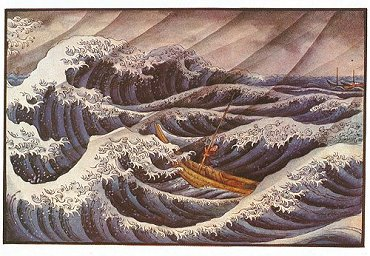

  
[Intangible Textual Heritage](../../index)  [Japan](../index) 

------------------------------------------------------------------------

<table width="75%">
<colgroup>
<col style="width: 50%" />
<col style="width: 50%" />
</colgroup>
<tbody>
<tr class="odd">
<td width="50%" data-valign="TOP"></td>
<td width="50%" data-valign="CENTER"><h1 id="ancient-tales-and-folk-lore-of-japan" data-align="CENTER">Ancient Tales and Folk-lore of Japan</h1>
<h2 id="by-richard-gordon-smith" data-align="CENTER">by Richard Gordon Smith</h2>
<h4 id="section" data-align="CENTER">[1918]</h4></td>
</tr>
</tbody>
</table>

------------------------------------------------------------------------

[Contents](#contents)    [Start Reading](atfj00)    [Page
Index](pageidx)    [Text \[Zipped\]](atfj.txt.gz)

------------------------------------------------------------------------

This is a memorable collection of historical legends and folktales from
Japan. Nearly all of them are set in a well-defined time and place,
instead of 'once upon a time.' Themes include ghosts; unrequited love
across social boundaries; Shinto landscape, tree and ocean spirits; and
tales driven by Bushido and Buddhist ethics. Not a few of these yarns
end up with someone committing Seppuku.

Smith does not try to dress up the language or narrative for westerners,
or sentimentalize the stories. Instead, he tells each story very
literally, even when they include supernatural elements. The result is
an anthology of Japanese 'magical realist' tales which contemporary
readers will find appealing.

Each chapter, with one exception, is illustrated by one or more colorful
plates done in a typical 19th century Japanese style, all of which are
included in this etext.

------------------------------------------------------------------------

[Title Page](atfj00)  
[Preface](atfj01)  
[Contents](atfj02)  
[I. The Golden Hairpin](atfj03)  
[II. The Spirit Of The Willow Tree](atfj04)  
[III. Ghost of the Violet Well](atfj05)  
[IV. Ghost Story of the Flute's Tomb](atfj06)  
[V. A Haunted Temple in Inaba Province](atfj07)  
[VI. A Carp Gives a Lesson in Perseverance](atfj08)  
[VII. Legends Told by a Fisherman on Lake Biwa, At Zeze](atfj09)  
[VIII. A Miraculous Sword](atfj10)  
[IX. 'The Procession of Ghosts'](atfj11)  
[X. A Faithful Servant](atfj12)  
[XI. Prince Hosokawa's Most Valuable Title-Deeds](atfj13)  
[XII. The Story of Kato Sayemon](atfj14)  
[XIII. Great Fire Caused by a Lady's Dress](atfj15)  
[XIV. History of Awoto Fujitsuna](atfj16)  
[XV. A Life Saved by a Spider and Two Doves](atfj17)  
[XVI. Murakami Yoshiteru's Faithfulness](atfj18)  
[XVII. A Story of Oki Islands](atfj19)  
[XVIII. Cape of the Woman's Sword](atfj20)  
[XIX. How Yogodayu Won A Battle](atfj21)  
[XX. The Isolated or Desolated Island](atfj22)  
[XXI. Chikubu Island, Lake Biwa](atfj23)  
[XXII. Reincarnation](atfj24)  
[XXIII. The Diving-Woman of Oiso Bay](atfj25)  
[XXIV. Theft And Recovery of a Golden Kwannon](atfj26)  
[XXV. Saigyo Hoshi's Rock](atfj27)  
[XXVI. How Masakuni Regained His Sight](atfj28)  
[XXVII. Sagami Bay](atfj29)  
[XXVIII. The King of Torijima](atfj30)  
[XXIX. The Perpetual Life-Giving Wine](atfj31)  
[XXX. The Hermit's Cave](atfj32)  
[XXXI. Yosoji's Camellia Tree](atfj33)  
[XXXII. Whales](atfj34)  
[XXXIII. The Holy Cherry Tree of Musubi-no-Kami Temple](atfj35)  
[XXXIV. A Story of Mount Kanzanrei](atfj36)  
[XXXV. White Bone Mountain](atfj37)  
[XXXVI. A Stormy Night's Tragedy](atfj38)  
[XXXVII. The Kakemono Ghost of Aki Province](atfj39)  
[XXXVIII. White Saké](atfj40)  
[XXXIX. The Blind Beauty](atfj41)  
[XL. The Secret of Iidamachi Pond](atfj42)  
[XLI. The Spirit of Yenoki](atfj43)  
[XLII. The Spirit of the Lotus Lily](atfj44)  
[XLIII. The Temple of the Awabi](atfj45)  
[XLIV. Human Fireflies](atfj46)  
[XLV. The Chrysanthemum Hermit](atfj47)  
[XLVI. The Princess Peony](atfj48)  
[XLVII. The Memorial Cherry Tree](atfj49)  
[XLVIII. The 'Jirohei' Cherry Tree, Kyoto](atfj50)  
[XLIX. The Snow Ghost](atfj51)  
[L. The Snow Tomb](atfj52)  
[LI. The Dragon-Shaped Plum Tree](atfj53)  
[LII. The Chessboard Cherry Tree](atfj54)  
[LIII. The Precious Sword 'Natori no Hoto'](atfj55)  
[LIV. The White Serpent God](atfj56)  
[LV. A Festival of the Awabi Fish](atfj57)  
[LVI. The Spirit of a Willow Tree Saves Family Honour](atfj58)  
[LVII. The Camphor Tree Tomb](atfj59)  
