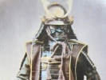

  
[Intangible Textual Heritage](../../index)  [Shinto](../index) 
[Index](index)  [Previous](bsd00)  [Next](bsd02) 

------------------------------------------------------------------------

[Buy this Book at
Amazon.com](https://www.amazon.com/exec/obidos/ASIN/B002FU5NUK/internetsacredte)

------------------------------------------------------------------------

  
*Bushido, the Soul of Japan*, by Inazo Nitobe, \[1905\], at Intangible
Textual Heritage

------------------------------------------------------------------------

TO MY BELOVED UNCLE

TOKITOSHI OTA

WHO TAUGHT ME TO REVERE THE PAST

AND

TO ADMIRE THE DEEDS OF THE SAMURAI

I DEDICATE

THIS LITTLE BOOK

------------------------------------------------------------------------

[Next: Contents](bsd02)
