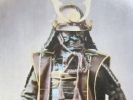

  
[Intangible Textual Heritage](../../index)  [Shinto](../index) 
[Index](index)  [Previous](bsd09)  [Next](bsd11) 

------------------------------------------------------------------------

[Buy this Book at
Amazon.com](https://www.amazon.com/exec/obidos/ASIN/B002FU5NUK/internetsacredte)

------------------------------------------------------------------------

  
*Bushido, the Soul of Japan*, by Inazo Nitobe, \[1905\], at Intangible
Textual Heritage

------------------------------------------------------------------------

p. 36

# CHAPTER V

## BENEVOLENCE, THE FEELING OF DISTRESS

LOVE, magnanimity, affection for others, sympathy and pity, were ever
recognised to be supreme virtues, the highest of all the attributes of
the human soul. It was deemed a princely virtue in a twofold sense:
princely among the manifold attributes of a noble spirit; princely as
particularly befitting a princely profession. We needed no Shakespeare
to feel--though, perhaps, like the rest of the world, we needed him to
express it--that mercy became a monarch better than his crown, that it
was above his sceptered sway. How often both Confucius and Mencius
repeat the highest requirement of a ruler of men to consist in
benevolence. Confucius would say,--"Let but a prince cultivate virtue,
people will

p. 37

flock to him; with people will come to him lands; lands will bring forth
for him wealth; wealth will give him the benefit of right uses. Virtue
is the root, and wealth an outcome." Again, "Never has there been a case
of a sovereign loving benevolence, and the people not loving
righteousness." Mencius follows close at his heels and says, "Instances
are on record where individuals attained to supreme power in a single
state, without benevolence, but never have I heard of a whole empire
falling into the hands of one who lacked this virtue. Also,--It is
impossible that any one should become ruler of the people to whom they
have not yielded the subjection of their hearts. Both defined this
indispensable requirement in a ruler by saying,
"Benevolence--benevolence is Man."

Under the regime of feudalism, which could easily degenerate into
militarism it was to benevolence that we owed our deliverance from
despotism of the worst kind. An utter surrender of "life and limb" on
the part of the governed would have left nothing for the

p. 38

governing but self-will, and this has for its natural consequence the
growth of that absolutism so often called "oriental despotism," as
though there were no despots of occidental history!

Let it be far from me to uphold despotism of any sort; but it is a
mistake to identify feudalism with it. When Frederick the Great wrote
that "Kings are the first servants of the State," jurists thought
rightly that a new era was reached in the development of freedom.
Strangely coinciding in time, in the backwoods of North-western Japan,
Yozan of Yonézawa made exactly the same declaration, showing that
feudalism was not all tyranny and oppression. A feudal prince, although
unmindful of owing reciprocal obligations to his vassals, felt a higher
sense of responsibility to his ancestors and to Heaven. He was a father
to his subjects, whom Heaven entrusted to his care. According to the
ancient *Chinese Book of Poetry*, "Until the house of Yin lost the
hearts of the people, they could appear before Heaven." And

p. 39

\[paragraph continues\] Confucius in his
*Great Learning* taught: "When the prince loves what the people love and
hates what the people hate, then is he what is called the parent of the
people." Thus are public opinion and monarchical will or democracy and
absolutism merged one in the other. Thus also, in a sense not usually
assigned to the term, Bushido accepted and corroborated paternal
government--paternal also as opposed to the less interested avuncular
government. (Uncle Sam's, to wit!) The difference between a despotic and
a paternal government lies in this, that in the one the people obey
reluctantly, while in the other they do so with "that proud submission,
that dignified obedience, that subordination of heart which kept alive,
even in servitude itself, the spirit of exalted freedom." [1](#fn_8) The old saying is not entirely false which
called the king of England the "king of devils, because of his subjects'
often insurrections against, and depositions of, their princes," and
which made

p. 40

the French monarch the "king of asses, because of their infinite taxes
and impositions," but which gave the title of the king of men to the
sovereign of Spain "because of his subjects' willing obedience." But
enough!

Virtue and absolute power may strike the Anglo-Saxon mind as terms which
it is impossible to harmonise. Pobyedonostseff has clearly set forth
before us the contrast in the foundations of English and other European
communities; namely, that these were organised on the basis of common
interest, while that was distinguished by a strongly developed
independent personality. What this Russian statesman says of the
personal dependence of individuals on some social alliance and in the
end of ends on the State, among the continental nations of Europe and
particularly among Slavonic peoples, is doubly true of the Japanese.
Hence not only is a free exercise of monarchical power not felt as
heavily by us as in Europe, but it is generally moderated by paternal
consideration for the feelings of the people. "Absolutism,"

p. 41

says Bismarck, "primarily demands in the ruler impartiality, honesty,
devotion to duty, energy and inward humility." If I may be allowed to
make one more quotation on this subject, I will cite from the speech of
the German Emperor at Coblenz, in which he spoke of "Kingship, by the
grace of God, with its heavy duties, its tremendous responsibilities to
the Creator alone, from which no man, no minister, no parliament, can
release the monarch."

We knew benevolence was a tender virtue and mother-like. If upright
Rectitude and stem justice were peculiarly masculine, Mercy had the
gentleness and the persuasiveness of a feminine nature. We were warned
against indulging in indiscriminate charity, without seasoning it with
justice and rectitude. Masamuné expressed it well in his oft-quoted
aphorism--"Rectitude carried to excess hardens into stiffness;
benevolence indulged beyond measure sinks into weakness." Fortunately
mercy was not so rare as it was beautiful, for it is universally true
that "The

p. 42

bravest are the tenderest, the loving are the daring." "*Bushi no
nasaké*"--the tenderness of a warrior--had a sound which appealed at
once to whatever was noble in us; not that the mercy of a samurai was
generically different from the mercy of any other being, but because it
implied mercy where mercy was not a blind impulse, but where it
recognised due regard to justice, and where mercy did not remain merely
a certain state of mind, but where it was backed with power to save or
kill. As economists speak of demand as being effectual or ineffectual,
similarly we may call the mercy of Bushi effectual, since it implied the
power of acting for the good or detriment of the recipient.

Priding themselves as they did in their brute strength and privileges to
turn it into account, the samurai gave full consent to what Mencius
taught concerning the power of love. "Benevolence," he says, "brings
under its sway whatever hinders its power, just as water subdues fire:
they only doubt the power of water to quench flames who try to

p. 43

extinguish with a cupful a whole burning waggon-load of fagots." He also
says that "the feeling of distress is the root of benevolence,"
therefore a benevolent man is ever mindful of those who are suffering
and in distress. Thus did Mencius long anticipate Adam Smith who founds
his ethical philosophy on sympathy.

It is indeed striking how closely the code of knightly honour of one
country coincides with that of others; in other words, how the
much-abused oriental ideas of morals find their counterparts in the
noblest maxims of European literature. If the well-known lines,

Hæ tibi erunt artes--pacisque imponere morem,  
Parcere subjectis, et debellare superbos,

were shown a Japanese gentleman, he might readily accuse the Mantuan
bard of plagiarising from the literature of his own country.

Benevolence to the weak, the down-trodden or the vanquished, was ever
extolled as peculiarly becoming to a samurai. Lovers of Japanese art
must be familiar with the

p. 44

representation of a priest riding backwards on a cow. The rider was once
a warrior who in his day made his name a by-word of terror. In that
terrible battle of Sumano-ura, (1184 A. D.) which was one of the most
decisive in our history, he overtook an enemy and in single combat had
him in the clutch of his gigantic arms. Now the etiquette of war
required that on such occasions no blood should be spilt, unless the
weaker party proved to be a man of rank or ability equal to that of the
stronger. The grim combatant would have the name of the man under him;
but he refusing to make it known, his helmet was ruthlessly tom off,
when the sight of a juvenile face, fair and beardless, made the
astonished knight relax his hold. Helping the youth to his feet, in
paternal tones he bade the stripling go: "Off, young prince, to thy
mother's side! The sword of Kumagayé shall never be tarnished by a drop
of thy blood. Haste and flee o'er yon pass before thine enemies come in
sight!" The young warrior refused to go and begged Kumagayé,

p. 45

for the honour of both, to dispatch him on the spot. Above the hoary
head of the veteran gleams the cold blade, which many a time before has
sundered the chords of life, but his stout heart quails; there flashes
athwart his mental eye the vision of his own boy, who this self-same day
marched to the sound of bugle to try his maiden arms; the strong hand of
the warrior quivers; again he begs his victim to flee for his life.
Finding all his entreaties vain and hearing the approaching steps of his
comrades, he exclaims: "If thou art overtaken, thou mayst fall at a more
ignoble hand than mine. O thou Infinite! receive his soul!" In an
instant the sword flashes in the air, and when it falls it is red with
adolescent blood. When the war is ended, we find our soldier returning
in triumph, but little cares he now for honour or fame; he renounces his
warlike career, shaves his head, dons a priestly garb, devotes the rest
of his days to holy pilgrimage, never turning his back to the West where
lies the Paradise whence salvation comes and whither the sun hastes
daily for his rest.

p. 46

Critics may point out flaws in this story, which is casuistically
vulnerable. Let it be: all the same it shows that Tenderness, Pity, and
Love were traits which adorned the most sanguinary exploits of a
samurai. It was an old maxim among them that "It becometh not the fowler
to slay the bird which takes refuge in his bosom." This in a large
measure explains why the Red Cross movement, considered so peculiarly
Christian, so readily found a firm footing among us. Decades before we
heard of the Geneva Convention, Bakin, our greatest novelist, had
familiarised us with the medical treatment of a fallen foe. In the
principality of Satsuma, noted for its martial spirit and education, the
custom prevailed for young men to practise music; not the blast of
trumpets or the beat of drums,--"those clamorous harbingers of blood and
death"--stirring us to imitate the actions of a tiger, but sad and
tender melodies on the *biwa*, [1](#fn_9)
soothing our fiery spirits, drawing our thoughts away from

p. 47

scent of blood and scenes of carnage. Polybius tells us of the
Constitution of Arcadia, which required all youths under thirty to
practise music, in order that this gentle art might alleviate the
rigours of the inclement region. It is to its influence that he
attributes the absence of cruelty in that part of the Arcadian
mountains.

Nor was Satsuma the only place in Japan where gentleness was inculcated
among the warrior class. A Prince of Shirakawa jots down his random
thoughts, and among them is the following: "Though they come stealing to
your bedside in the silent watches of the night, drive not away, but
rather cherish these--the fragrance of flowers, the sound of distant
bells, the insect hummings of a frosty night." And again, "Though they
may wound your feelings, these three you have only to forgive, the
breeze that scatters your flowers, the cloud that hides your moon, and
the man who tries to pick quarrels with you."

It was ostensibly to express, but actually to cultivate, these gentler
emotions that the

p. 48

writing of verses was encouraged. Our poetry has therefore a strong
undercurrent of pathos and tenderness. A well-known anecdote of a rustic
samurai illustrates the case in point. When he was told to learn
versification, and "The Warbler's Notes" [1](#fn_10) was given him for the subject of his first
attempt, his fiery spirit rebelled and he flung at the feet of his
master this uncouth production, which ran

"The brave warrior keeps apart  
The ear that might listen  
To the warbler's song."

His master, undaunted by the crude sentiment, continued to encourage the
youth, until one day the music of his soul was awakened to respond to
the sweet notes of the *uguisu*, and he wrote

"Stands the warrior, mailed and strong,  
To hear the uguisu's song,  
Warbled sweet the trees among."

We admire and enjoy the heroic incident in Körner's short life, when, as
he lay wounded

p. 49

on the battle-field, he scribbled his famous *Farewell to Life*.
Incidents of a similar kind were not at all unusual in our warfare. Our
pithy, epigrammatic poems were particularly well suited to the
improvisation of a single sentiment. Everybody of any education was
either a poet or a poetaster. Not infrequently a marching soldier might
be seen to halt, take his writing utensils from his belt, and compose an
ode,--and such papers were found afterward in the helmets or the
breastplates when these were removed from their lifeless wearers.

What Christianity has done in Europe toward rousing compassion in the
midst of belligerent horrors, love of music and letters has done in
Japan. The cultivation of tender feelings breeds considerate regard for
the sufferings of others. Modesty and complaisance, actuated by respect
for others' feelings, are at the root of politeness.

------------------------------------------------------------------------

### Footnotes

[39:1](bsd10.htm#fr_8) Burke, *French
Revolution*.

[46:1](bsd10.htm#fr_9) A musical instrument,
resembling the guitar.

[48:1](bsd10.htm#fr_10) The uguisu or warbler,
sometimes called the nightingale of Japan.

------------------------------------------------------------------------

[Next: Chapter VI: Politeness](bsd11)
