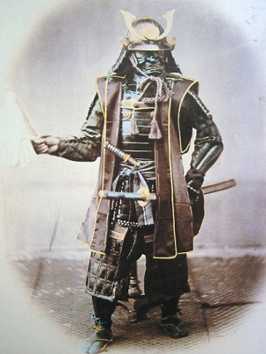

  
[Intangible Textual Heritage](../../index)  [Shinto](../index) 

------------------------------------------------------------------------

[Buy this Book at
Amazon.com](https://www.amazon.com/exec/obidos/ASIN/B002FU5NUK/internetsacredte)

------------------------------------------------------------------------

<table width="75%">
<colgroup>
<col style="width: 50%" />
<col style="width: 50%" />
</colgroup>
<tbody>
<tr class="odd">
<td width="50%" data-valign="TOP"></td>
<td width="50%" data-valign="CENTER"><h1 id="bushido" data-align="CENTER">BUSHIDO</h1>
<h5 id="the-soul-of-japan" data-align="CENTER">The Soul of Japan</h5>
<h5 id="an-exposition-of-japanese-thought" data-align="CENTER">An Exposition of Japanese Thought</h5>
<h2 id="by-inazo-nitobe" data-align="CENTER">by Inazo Nitobe</h2>
<h4 id="section" data-align="CENTER">[1905]</h4></td>
</tr>
</tbody>
</table>

------------------------------------------------------------------------

[Contents](#contents)    [Start Reading](bsd00)    [Page
Index](pageidx)    [Text \[Zipped\]](bsd.txt.gz)

------------------------------------------------------------------------

|                                                                                                                           |
|---------------------------------------------------------------------------------------------------------------------------|
|  |

This is Inazo Nitobe's account of the Samurai code, Bushido. This was a
far-reaching philosophy of life which governed every action of the
warrior caste. An understanding of Bushido is crucial if you want to
understand Japanese culture at a deep level.

------------------------------------------------------------------------

 [Title Page](bsd00)  
[Dedication](bsd01)  
[Contents](bsd02)  
[Preface to the First Edition](bsd03)  
[Introduction](bsd04)  
[Epigrams](bsd05)  
[Chapter I: Bushido As an Ethical System](bsd06)  
[Chapter II: Sources of Bushido](bsd07)  
[Chapter III: Rectitude or Justice](bsd08)  
[Chapter IV: Courage, the Spirit of Daring and Bearing](bsd09)  
[Chapter V: Benevolence, the Feeling of Distress](bsd10)  
[Chapter VI: Politeness](bsd11)  
[Chapter VII: Veracity and Sincerity](bsd12)  
[Chapter VIII: Honour](bsd13)  
[Chapter IX: The Duty of Loyalty](bsd14)  
[Chapter X: The Education and Training of a Samurai](bsd15)  
[Chapter XI: Self-Control](bsd16)  
[Chapter XII: The Institutions of Suicide and Redress](bsd17)  
[Chapter XIII: The Sword, The Soul of the Samurai](bsd18)  
[Chapter XIV: The Training and Position of Woman](bsd19)  
[Chapter XV: The Influence of Bushido](bsd20)  
[Chapter XVI: Is Bushido Still Alive?](bsd21)  
[Chapter XVII: The Future Of Bushido](bsd22)  
