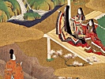

  
[Intangible Textual Heritage](../../index)  [Japan](../index) 
[Index](index)  [Previous](gen00)  [Next](gen02) 

------------------------------------------------------------------------

[Buy this Book at
Amazon.com](https://www.amazon.com/exec/obidos/ASIN/014243714X/internetsacredte)

------------------------------------------------------------------------

[Buy this Book on
Kindle](https://www.amazon.com/exec/obidos/ASIN/B0031574OG/internetsacredte)

------------------------------------------------------------------------

  
*Genji Monogatari*, by Lady Murasaki Shikibu, tr. Suematsu Kencho,
\[1900\], at Intangible Textual Heritage

------------------------------------------------------------------------

CONTENTS

|        |                              |                           |
|--------|------------------------------|---------------------------|
|        | Introduction                 | [3](gen02.htm#page_3)     |
| I.     | The Chamber of Kiri          | [11](gen03.htm#page_11)   |
| II\.   | The Broom-like Tree          | [28](gen04.htm#page_28)   |
| III\.  | Beautiful Cicada             | [62](gen05.htm#page_62)   |
| IV\.   | Evening Glory                | [68](gen06.htm#page_68)   |
| V.     | Young Violet.                | [94](gen07.htm#page_94)   |
| VI\.   | Saffron Flower               | [117](gen08.htm#page_117) |
| VII\.  | Maple Fête                   | [134](gen09.htm#page_134) |
| VIII\. | Flower-Feast                 | [143](gen10.htm#page_143) |
| IX\.   | Hollyhock                    | [147](gen11.htm#page_147) |
| X.     | Divine Tree                  | [157](gen12.htm#page_157) |
| XI\.   | Villa of Falling Flowers     | [170](gen13.htm#page_170) |
| XII\.  | Exile at Suma                | [172](gen14.htm#page_172) |
| XIII\. | Exile at Akashi              | [187](gen15.htm#page_187) |
| XIV\.  | The Beacon                   | [196](gen16.htm#page_196) |
| XV\.   | Overgrown Mugwort            | [202](gen17.htm#page_202) |
| XVI\.  | Barrier House                | [208](gen18.htm#page_208) |
| XVII\. | Competitive Show of Pictures | [211](gen19.htm#page_211) |

------------------------------------------------------------------------

[Next: Introduction](gen02)

