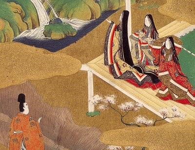

  
[Intangible Textual Heritage](../../index)  [Japan](../index) 

------------------------------------------------------------------------

[Buy this Book at
Amazon.com](https://www.amazon.com/exec/obidos/ASIN/014243714X/internetsacredte)

------------------------------------------------------------------------

[Buy this Book on
Kindle](https://www.amazon.com/exec/obidos/ASIN/B0031574OG/internetsacredte)

------------------------------------------------------------------------

<table width="75%">
<colgroup>
<col style="width: 50%" />
<col style="width: 50%" />
</colgroup>
<tbody>
<tr class="odd">
<td width="50%" data-valign="TOP"></td>
<td width="50%" data-valign="CENTER"><h1 id="genji-monogatari" data-align="CENTER">Genji Monogatari</h1>
<h2 id="by-lady-murasaki-shikibu" data-align="CENTER">by Lady Murasaki Shikibu</h2>
<h2 id="tr.-by-suematsu-kencho" data-align="CENTER">tr. by Suematsu Kencho</h2>
<h4 id="section" data-align="CENTER">[1900]</h4></td>
</tr>
</tbody>
</table>

------------------------------------------------------------------------

[Contents](#contents)    [Start Reading](gen00)    [Page
Index](pageidx)    [Text \[Zipped\]](gen.txt.gz)

------------------------------------------------------------------------

|                                                                                                                           |
|---------------------------------------------------------------------------------------------------------------------------|
|  |

Genji Monogatari, or the Tale of Genji, is a classic work of Japanese
fiction from the tenth century. Written by a noblewoman, Lady Murasaki,
Genji is a milestone in world literature. It is a gateway into the
courtly life of 10th century feudal Japan, during the Heian period. It
has been called the first novel, and the writer, Lady Murasaki, is
considered a pioneer of women's literature. This was the first English
translation of Genji, an abridgement which includes chapters 1 through
17 (out of 54). It is the only one in the public domain in most
countries. Successive translations by Arthur Waley, Edward
Seidensticker, and Royall Tyler are more complete, and have been praised
critically.

Production Notes: This translation, originally
published in 1882, was extracted from a reprint in Japanese Literature,
Colonial Press \[1900\]. A short, unrelated, section of translations of
Japanese poetry in that book was excluded from this etext.--John Bruno
Hare, December 31st, 2008.

------------------------------------------------------------------------

 [Title Page](gen00)  
[Table of Contents](gen01)  
[Introduction](gen02)  
[Chapter I: The Chamber of Kiri](gen03)  
[Chapter II: The Broom-Like Tree](gen04)  
[Chapter III: Beautiful Cicada](gen05)  
[Chapter IV: Evening Glory](gen06)  
[Chapter V: Young Violet](gen07)  
[Chapter VI: Saffron Flower](gen08)  
[Chapter VII: Maple Fete](gen09)  
[Chapter VIII: Flower-Feast](gen10)  
[Chapter IX: Hollyhock](gen11)  
[Chapter X: Divine Tree](gen12)  
[Chapter XI: Villa of Falling Flowers](gen13)  
[Chapter XII: Exile at Suma](gen14)  
[Chapter XIII: Exile at Akashi](gen15)  
[Chapter XIV: The Beacon](gen16)  
[Chapter XV: Overgrown Mugwort](gen17)  
[Chapter XVI: Barrier House](gen18)  
[Chapter XVII: Competitive Show of Pictures](gen19)  
