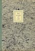
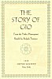

  
[Intangible Textual Heritage](../../index)  [Japan](../index) 
[Index](index)  [Next](gio01) 

------------------------------------------------------------------------

# THE STORY OF GIO

## From the Heke Monogatari

## Retold by Ridgely Torrence

#### \[1935\]

#### JAPAN SOCIETY

#### New York

###### Scanned at Intangible Textual Heritage, September, 2004. John Bruno Hare, transcriber. This text is in the public domain because it was not renewed at the US Copyright Office in a timely manner as required by law at the time. This text is in the public domain. This eBook is for the use of anyone anywhere at no cost and with almost no restrictions whatsoever. You may copy it, give it away or re-use it subject to the sacred-texts terms of service (https://ith.oarc.science/tos.htm).

 

[  
Click to enlarge](img/front.jpg)  
Frontispiece  

[  
Click to enlarge](img/cover.jpg)  
Cover  

[  
Click to enlarge](img/title.jpg)  
Title Page  

p. ii

COPYRIGHT 1935, JAPAN SOCIETY

------------------------------------------------------------------------

[Next: Foreword](gio01)
