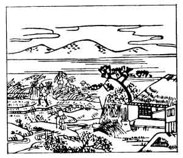

  
[Intangible Textual Heritage](../../index)  [Japan](../index) 
[Index](index)  [Previous](hvj001)  [Next](hvj003) 

------------------------------------------------------------------------

[Buy this Book on
Kindle](https://www.amazon.com/exec/obidos/ASIN/B002HRE8VG/internetsacredte)

------------------------------------------------------------------------

  
*A Hundred Verses from Old Japan (The Hyakunin-isshu)*, tr. by William
N. Porter, \[1909\], at Intangible Textual Heritage

------------------------------------------------------------------------

p. 1

 

### 1

### THE EMPEROR TENCHI

### TENCHI TENNŌ

  Aki no ta no  
Kari ho no iho no  
  Toma wo arami  
Waga koromode wa  
Tsuyu ni nure-tsutsu.

OUT in the fields this autumn day  
  They're busy reaping grain ;  
I sought for shelter ’neath this roof,  
  But fear I sought in vain,—  
  My sleeve is wet with rain.

The Emperor Tenchi reigned from A.D. 668 to 671, his capital was Otsu,
not far from Kyōto, and he is chiefly remembered for his kindness and
benevolence. It is related, that one day he was scaring birds away,
while the harvesters were gathering in the crop, and, when a shower of
rain came on, he took shelter in a neighbouring hut; it was, however,
thatched only with coarse rushes, which did not afford him much
protection, and this is the incident on which the verse is founded.

The picture shows the harvesters hard at work in the field, and the hut
where the Emperor took shelter.

------------------------------------------------------------------------

[Next: 2. The Empress Jitō: Jitō Tennō](hvj003)
