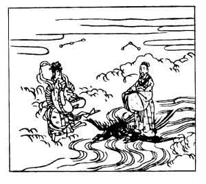

  
[Intangible Textual Heritage](../../index)  [Japan](../index) 
[Index](index)  [Previous](hvj006)  [Next](hvj008) 

------------------------------------------------------------------------

[Buy this Book on
Kindle](https://www.amazon.com/exec/obidos/ASIN/B002HRE8VG/internetsacredte)

------------------------------------------------------------------------

  
*A Hundred Verses from Old Japan (The Hyakunin-isshu)*, tr. by William
N. Porter, \[1909\], at Intangible Textual Heritage

------------------------------------------------------------------------

p. 6

 

### 6

### THE IMPERIAL ADVISER YAKAMOCHI

### CHŪ-NAGON YAKAMOCHI

  Kasasagi no  
Wataseru hashi ni  
  Oku shimo no  
Shiroki wo mireba  
Yo zo fuke ni keru.

WHEN on the Magpies' Bridge I see  
  The Hoar-frost King has cast  
His sparkling mantle, well I know  
  The night is nearly past,  
  Daylight approaches fast.

The author of this verse was Governor of the
Province of Kōshū, and Viceroy of the more or less uncivilized northern
and eastern parts of Japan; he died A.D. 785. There was a bridge or
passageway in the Imperial Palace at Kyōto called the Magpies' Bridge,
but there is also an allusion here to the old legend about the Weaver
and Herdsman. It is said, that the Weaver (the star Vega) was a maiden,
who dwelt on one side of the River of the Milky Way, and who was
employed in making clothes for the Gods. But one day the Sun took pity
upon her, and gave her in marriage to the Herdboy (the star Aquila), who
lived on the other side of the river. But as the result of this was that
the supply of clothes fell short, she was only permitted to visit her
husband once a year, viz. on the seventh night of the seventh month; and
on this night, it is said, the magpies in a dense flock form a bridge
for her across the river. The hoar frost forms just before day breaks.
The illustration shows the Herdboy crossing on the Bridge of Magpies to
his bride.

------------------------------------------------------------------------

[Next: 7. Nakamaro Abe: Abe no Nakamaro](hvj008)
