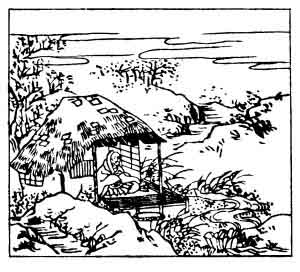

  
[Intangible Textual Heritage](../../index)  [Japan](../index) 
[Index](index)  [Previous](hvj008)  [Next](hvj010) 

------------------------------------------------------------------------

[Buy this Book on
Kindle](https://www.amazon.com/exec/obidos/ASIN/B002HRE8VG/internetsacredte)

------------------------------------------------------------------------

  
*A Hundred Verses from Old Japan (The Hyakunin-isshu)*, tr. by William
N. Porter, \[1909\], at Intangible Textual Heritage

------------------------------------------------------------------------

p. 8

 

### 8

### THE PRIEST KIZEN

### KIZEN HŌSHI

  Waga iho wa  
Miyako no tatsumi  
  Shika zo sumu  
Yo wo Uji yama to  
Hito wa iu nari.

MY home is near the Capital,  
  My humble cottage bare  
Lies south-east on Mount Uji; so  
  The people all declare  
  My life's a 'Hill of Care'.

The priest Kizen lived on Mount Uji, which lies
south-east of Kyōto, at this time the Capital. The word *uji* or *ushi*
means 'sorrow'; so he says that, as he lives on Mount Sorrow, his
friends say his life is 'a mountain of sorrows '. Notice also the two
words *yama to* in the fourth line, which, if read as one word, form the
ancient name of Japan. In the picture we see the priest sitting alone in
his little hut, his poverty being shown by the patches on the
roof.

------------------------------------------------------------------------

[Next: 9. Komachi Ono: Ono no Komachi](hvj010)
