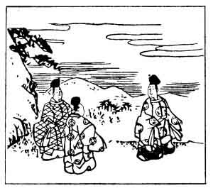

  
[Intangible Textual Heritage](../../index)  [Japan](../index) 
[Index](index)  [Previous](hvj016)  [Next](hvj018) 

------------------------------------------------------------------------

[Buy this Book on
Kindle](https://www.amazon.com/exec/obidos/ASIN/B002HRE8VG/internetsacredte)

------------------------------------------------------------------------

  
*A Hundred Verses from Old Japan (The Hyakunin-isshu)*, tr. by William
N. Porter, \[1909\], at Intangible Textual Heritage

------------------------------------------------------------------------

p. 16

 

### 16

### THE IMPERIAL ADVISER YUKI-HIRA ARIWARA

### CHŪ-NAGON ARIWARA NO YUKI-HIRA

  Tachi wakare  
Inaba no yama no  
  Mine ni ōru  
Matsu to shi kikaba  
Ima kaeri-komu.

IF breezes on Inaba's peak  
  Sigh through the old *pine* tree,  
To whisper in my lonely ears  
  That thou dost *pine* for me,—  
  Swiftly I'll fly to thee.

Yuki-hira was the Governor of the Province of Inaba, and half-brother of
the writer of the next verse ([17](hvj018.htm#page_17)); he died in the
year 893, aged 75.

The word *matsu* in the original may mean 'a pine tree', but it may also
mean 'waiting and longing for'. This is an instance of a 'pivot-word',
imitated to a certain extent in the translation, although in English we
have to employ the word twice over, while it only appears once in the
Japanese.

The illustration shows the pine tree on the mountain, and the poet
standing under it with two attendants.

------------------------------------------------------------------------

[Next: 17. The Minister Nari-hira Ariwara: Ariwara no Nari-hira
Ason](hvj018)
