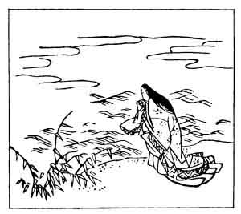

  
[Intangible Textual Heritage](../../index)  [Japan](../index) 
[Index](index)  [Previous](hvj019)  [Next](hvj021) 

------------------------------------------------------------------------

[Buy this Book on
Kindle](https://www.amazon.com/exec/obidos/ASIN/B002HRE8VG/internetsacredte)

------------------------------------------------------------------------

  
*A Hundred Verses from Old Japan (The Hyakunin-isshu)*, tr. by William
N. Porter, \[1909\], at Intangible Textual Heritage

------------------------------------------------------------------------

p. 19

 

### 19

### THE PRINCESS ISE

### ISE

  Naniwa gata  
Mijikaki ashi no  
Fushi no ma mo  
  Awade kono yo wo,  
  Sugushite yo to ya.

SHORT as the joints of bamboo reeds  
  That grow beside the sea  
On pebble beach at Naniwa,  
  I hope the time may be,  
  When thou ’rt away from me.

The Princess Ise was the daughter of Tsugukage
Fujiwara, the Governor of the Province of Ise; hence her name. She lived
at the Imperial Court, and was the favourite maid of honour of the
Emperor Uda, who reigned A.D. 888-897. She was noted for her talents and
gentle disposition, and was the mother of Prince Katsura. Naniwa is the
old name of Osaka. The picture shows the Princess on the pebble beach at
Naniwa, and to the left are the bamboo reeds.

------------------------------------------------------------------------

[Next: 20. The Heir-Apparent Moto-yoshi: Moto-yoshi Shinnō](hvj021)
