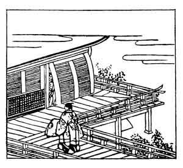

  
[Intangible Textual Heritage](../../index)  [Japan](../index) 
[Index](index)  [Previous](hvj020)  [Next](hvj022) 

------------------------------------------------------------------------

[Buy this Book on
Kindle](https://www.amazon.com/exec/obidos/ASIN/B002HRE8VG/internetsacredte)

------------------------------------------------------------------------

  
*A Hundred Verses from Old Japan (The Hyakunin-isshu)*, tr. by William
N. Porter, \[1909\], at Intangible Textual Heritage

------------------------------------------------------------------------

p. 20

 

### 20

### THE HEIR-APPARENT MOTO-YOSHI

### MOTO-YOSHI SHINNŌ

  Wabi nureba  
Ima hata onaji  
  Naniwa naru  
Mi wo tsukushite mo  
Awamu to zo omou.

WE met but for a moment, and  
  I'm wretched as before;  
The *tide* shall *measure* out my life,  
  Unless I see once more  
  The maid, whom I adore.

The composer of this verse was the son of the Emperor Yōzei, who reigned
A.D. 877-884; he was noted for his love-affairs, and he died in the year
943.

*Mi wo tsukushite mo* means 'even though I die in the attempt', but
*miotsukushi* is a graduated stick, set up to measure the rise and fall
of the tide; and Naniwa, the modern seaport of Osaka, seems to have been
inserted chiefly as the place where this tide-gauge was set up. The poet
may have meant, that the river of his tears was so deep as to require a
gauge to measure it; or, as Professor MacCauley reads it, he was
hinting, that if he could not attain his ends his body would be found at
the tide-gauge in Naniwa Bay. The picture seems to show the poet on the
verandah and his lady-love looking through the screen.

------------------------------------------------------------------------

[Next: 21. The Priest Sosei: Sosei Hōshi](hvj022)
