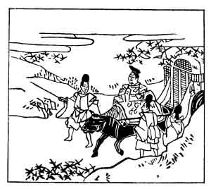

  
[Intangible Textual Heritage](../../index)  [Japan](../index) 
[Index](index)  [Previous](hvj026)  [Next](hvj028) 

------------------------------------------------------------------------

[Buy this Book on
Kindle](https://www.amazon.com/exec/obidos/ASIN/B002HRE8VG/internetsacredte)

------------------------------------------------------------------------

  
*A Hundred Verses from Old Japan (The Hyakunin-isshu)*, tr. by William
N. Porter, \[1909\], at Intangible Textual Heritage

------------------------------------------------------------------------

p. 26

 

### 26

### PRINCE TEI-SHIN

### TEI-SHIN KŌ

  Ogura yama  
Mine no momiji-ba  
  Kokoro araba  
Ima hito tabi no  
Miyuki matanamu.

THE maples of Mount Ogura,  
  If they could understand,  
Would keep their brilliant leaves, until  
  The Ruler of this land  
  Pass with his royal band.

The above is the posthumous name given to Tadahira
Fujiwara, Imperial Chief Minister of State; he died about the year 936.
It is related that the Emperor Uda, after his abdication, visited Mount
Ogura in Yamashiro province, and was so greatly struck with the autumn
tints of the maples, that he ordered Tada-hira to invite his son, the
Emperor Daigo, to visit the scene; and this verse was the invitation.
The picture shows the Emperor with his attendants, and the maples all
around him.

------------------------------------------------------------------------

[Next: 27. The Imperial Adviser Kanesuke: Chū-Nagon Kanesuke](hvj028)
