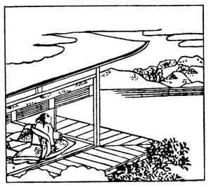

  
[Intangible Textual Heritage](../../index)  [Japan](../index) 
[Index](index)  [Previous](hvj031)  [Next](hvj033) 

------------------------------------------------------------------------

[Buy this Book on
Kindle](https://www.amazon.com/exec/obidos/ASIN/B002HRE8VG/internetsacredte)

------------------------------------------------------------------------

  
*A Hundred Verses from Old Japan (The Hyakunin-isshu)*, tr. by William
N. Porter, \[1909\], at Intangible Textual Heritage

------------------------------------------------------------------------

p. 31

 

### 31

### KORENORI SAKA-NO-UYE

### SAKA-NO-UYE NO KORENORI

  Asaborake  
Ariake no tsuki to  
  Miru made ni  
Yoshino no sato ni  
Fureru shira yuki.

SURELY the morning moon, I thought,  
  Has bathed the hill in light  
But, no; I see it is the snow  
  That, falling in the night,  
  Has made Yoshino white.

Little is known about this poet, but he is said to
have lived some time in the tenth century. Yoshino is a mountain village
in the Province of Yamato, famous for its cherry blossoms; at one time
it contained the Imperial Summer Palace. In the illustration we see the
poet looking across at the village on the hills all covered with
snow.

------------------------------------------------------------------------

[Next: 32. Tsuraki Harumichi: Harumichi no Tsuraki](hvj033)
