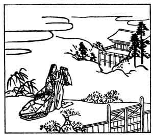

  
[Intangible Textual Heritage](../../index)  [Japan](../index) 
[Index](index)  [Previous](hvj038)  [Next](hvj040) 

------------------------------------------------------------------------

[Buy this Book on
Kindle](https://www.amazon.com/exec/obidos/ASIN/B002HRE8VG/internetsacredte)

------------------------------------------------------------------------

  
*A Hundred Verses from Old Japan (The Hyakunin-isshu)*, tr. by William
N. Porter, \[1909\], at Intangible Textual Heritage

------------------------------------------------------------------------

p. 38

 

### 38

### UKON

  Wasuraruru  
Mi woba omowazu  
  Chikahite-shi  
Hito no inochi no  
Oshiku mo aru kana.

MY broken heart I don't lament,  
  To destiny I bow;  
But thou hast broken solemn oaths,—  
  I pray the Gods may now  
  Absolve thee from thy vow.

The Lady Ukon is supposed to have been deserted by
her husband, and in this poem she regrets, not so much her own sorrow,
as the fact that he has broken his sworn oath, and is therefore in
danger of divine vengeance. The illustration shows her all alone at the
gate, with the house in the background, evidently waiting for the
husband who has forsaken her.

------------------------------------------------------------------------

[Next: 39. The Privy Councillor Hitoshi: Sangi Hitoshi](hvj040)
