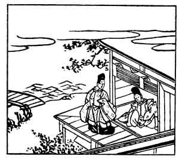

  
[Intangible Textual Heritage](../../index)  [Japan](../index) 
[Index](index)  [Previous](hvj040)  [Next](hvj042) 

------------------------------------------------------------------------

[Buy this Book on
Kindle](https://www.amazon.com/exec/obidos/ASIN/B002HRE8VG/internetsacredte)

------------------------------------------------------------------------

  
*A Hundred Verses from Old Japan (The Hyakunin-isshu)*, tr. by William
N. Porter, \[1909\], at Intangible Textual Heritage

------------------------------------------------------------------------

p. 40

 

### 40

### KANEMORI TAIRA

### TAIRA NO KANEMORI

  Shinoburedo  
Iro ni ide ni keri  
  Waga koi wa  
Mono ya omou to  
Hito no tou made.

ALAS! the blush upon my cheek,  
  Conceal it as I may,  
Proclaims to all that I'm in love,  
  Till people smile and say—  
  'Where are thy thoughts to-day?'

This verse is said to have been composed in the year 949, at the request
of the Emperor Daigo. The Taira family sprang from the Emperor Kwammu,
attained great influence three hundred years later, but finally fell
before the power of the Minamoto clan in the year 1185 (see note to
verse No. [28](hvj029.htm#page_28)).

------------------------------------------------------------------------

[Next: 41. Tadami Nibu: Nibu no Tadami](hvj042)
