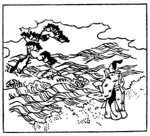

  
[Intangible Textual Heritage](../../index)  [Japan](../index) 
[Index](index)  [Previous](hvj042)  [Next](hvj044) 

------------------------------------------------------------------------

[Buy this Book on
Kindle](https://www.amazon.com/exec/obidos/ASIN/B002HRE8VG/internetsacredte)

------------------------------------------------------------------------

  
*A Hundred Verses from Old Japan (The Hyakunin-isshu)*, tr. by William
N. Porter, \[1909\], at Intangible Textual Heritage

------------------------------------------------------------------------

p. 42

 

### 42

### MOTO-SUKE KIYOWARA

### KIYOWARA NO MOTO-SUKE

  Chigiriki na  
Katami-ni sode wo  
  Shibori-tsutsu  
Sue no Matsu-Yama  
Nami kosaji to wa.

OUR sleeves, all wet with tears, attest  
  That you and I agree  
That to each other we'll be true,  
  Till Pine-tree Hill shall be  
  Sunk far beneath the sea.

Moto-suke lived towards the close of the tenth
century, and was the son of the writer of verse No.
[36](hvj037.htm#page_36). The idea of one's sleeves being wet with tears
is a common one in Japanese poetry. Matsu-yama, or Pine-tree Hill, is in
Northern Japan, on the boundaries between the Provinces of Rikuchū and
Nambu. In the illustration the hill with the pine tree on the top
appears to be just sinking beneath the waves.

------------------------------------------------------------------------

[Next: 43. The Imperial Adviser Yatsu-tada: Chū-nagon
Yatsu-tada](hvj044)
