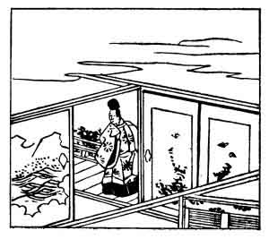

  
[Intangible Textual Heritage](../../index)  [Japan](../index) 
[Index](index)  [Previous](hvj044)  [Next](hvj046) 

------------------------------------------------------------------------

[Buy this Book on
Kindle](https://www.amazon.com/exec/obidos/ASIN/B002HRE8VG/internetsacredte)

------------------------------------------------------------------------

  
*A Hundred Verses from Old Japan (The Hyakunin-isshu)*, tr. by William
N. Porter, \[1909\], at Intangible Textual Heritage

------------------------------------------------------------------------

p. 44

 

### 44

### THE IMPERIAL ADVISER ASA-TADA

### CHŪ-NAGON ASA-TADA

  Au koto no  
Taete shi nakuba  
  Naka naka ni  
Hito wo mo mi wo mo  
Uramizaramashi.

TO fall in love with womankind  
  Is my unlucky fate;  
If only it were otherwise,  
  I might appreciate  
  Some men, whom now I hate.

The writer of this verse was the son of Sadakata, a
Minister-of-the-Right, and is said to have died in the year 961. The
verse was composed at the instance of the Emperor Daigo, and is
apparently written in praise of a life of single blessedness. The
translation does not give the full force of the last two lines, which
mean literally, 'I should not dislike both other people and myself too.'
The illustration shows Asa-tada walking on the verandah outside his
house, perhaps composing this verse.

------------------------------------------------------------------------

[Next: 45. Prince Ken-toku: Ken-toku Kō](hvj046)
