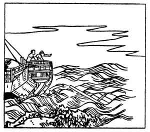

  
[Intangible Textual Heritage](../../index)  [Japan](../index) 
[Index](index)  [Previous](hvj046)  [Next](hvj048) 

------------------------------------------------------------------------

[Buy this Book on
Kindle](https://www.amazon.com/exec/obidos/ASIN/B002HRE8VG/internetsacredte)

------------------------------------------------------------------------

  
*A Hundred Verses from Old Japan (The Hyakunin-isshu)*, tr. by William
N. Porter, \[1909\], at Intangible Textual Heritage

------------------------------------------------------------------------

p. 46

 

### 46

### THE PRIEST NE-YOSHI-TADA

### SŌ NE-YOSHI-TADA

  Yura no to wo  
Wataru funabito  
  Kaji wo tae  
Yukue mo shiranu  
Koi no michi kana.

THE fishing-boats are tossed about,  
  When stormy winds blow strong;  
With rudder lost, how can they reach  
  The port for which they long?  
  So runs the old love-song.

Nothing is known of the writer of this verse, but he
is said to have lived in. the tenth century. The meaning, not very
clearly expressed in the translation, is that the course of true love is
as uncertain as the course of the rudderless fishing-boats. In the
illustration we see the fishing-boat tossing about on a rough sea and
the rudder duly floating away astern.

------------------------------------------------------------------------

[Next: 47. The Priest Ye-kei: Ye-kei Hōshi](hvj048)
