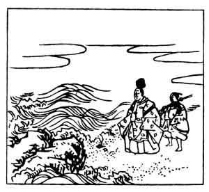

  
[Intangible Textual Heritage](../../index)  [Japan](../index) 
[Index](index)  [Previous](hvj048)  [Next](hvj050) 

------------------------------------------------------------------------

[Buy this Book on
Kindle](https://www.amazon.com/exec/obidos/ASIN/B002HRE8VG/internetsacredte)

------------------------------------------------------------------------

  
*A Hundred Verses from Old Japan (The Hyakunin-isshu)*, tr. by William
N. Porter, \[1909\], at Intangible Textual Heritage

------------------------------------------------------------------------

p. 48

 

### 48

### SHIGE-YUKI MINAMOTO

### MINAMOTO NO SHIGE-YUKI

  Kaze wo itami  
Iwa utsu nami no  
  Onore nomi  
Kudakete mono wo  
Omou koro kana.

THE waves that dash against the rocks  
  Are broken by the wind  
And turned to spray; my loving heart  
  Is broken too, I find,  
  Since thou art so unkind.

The writer of this verse is said to have died in the
year 963; for a note about the great Minamoto family, see verse No.
[28](hvj029.htm#page_28). In the picture we see Shige-yuki, with an
attendant carrying his sword, walking on the shore, while the waves
break into spray at his feet.

------------------------------------------------------------------------

[Next: 49. The Minister Yoshi-nobu, of Priestly Rank: Ōnakatomi no
Yoshi-nobu Ason](hvj050)
