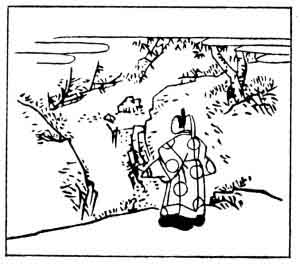

  
[Intangible Textual Heritage](../../index)  [Japan](../index) 
[Index](index)  [Previous](hvj055)  [Next](hvj057) 

------------------------------------------------------------------------

[Buy this Book on
Kindle](https://www.amazon.com/exec/obidos/ASIN/B002HRE8VG/internetsacredte)

------------------------------------------------------------------------

  
*A Hundred Verses from Old Japan (The Hyakunin-isshu)*, tr. by William
N. Porter, \[1909\], at Intangible Textual Heritage

------------------------------------------------------------------------

p. 55

 

### 55

### THE FIRST ADVISER OF STATE KINTŌ

### DAI-NAGON KINTŌ

  Taki no oto wa  
Taete hisashiku  
  Narinuredo  
Na koso nagarete  
Nao kikoe kere.

THIS waterfall's melodious voice  
  Was famed both far and near;  
Although it long has ceased to flow,  
  Yet still with memory's ear  
  Its gentle splash I hear.

This poet was the father of the writer of verse No.
[64](hvj065.htm#page_64), and was a member of the Fujiwara family at the
zenith of their power; he was a great statesman and scholar, and died in
the year 1041. The verse was written in praise of a waterfall that had
been made by the orders of the Emperor Saga early in the ninth century,
but which had by this time ceased to exist; and the illustration well
shows the watercourse now run dry.

------------------------------------------------------------------------

[Next: 56. Izumi Shikibu](hvj057)
