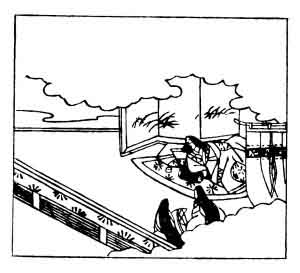

  
[Intangible Textual Heritage](../../index)  [Japan](../index) 
[Index](index)  [Previous](hvj056)  [Next](hvj058) 

------------------------------------------------------------------------

[Buy this Book on
Kindle](https://www.amazon.com/exec/obidos/ASIN/B002HRE8VG/internetsacredte)

------------------------------------------------------------------------

  
*A Hundred Verses from Old Japan (The Hyakunin-isshu)*, tr. by William
N. Porter, \[1909\], at Intangible Textual Heritage

------------------------------------------------------------------------

p. 56

 

### 56

### IZUMI SHIKIBU

  Arazaramu  
Kono yo no hoka no  
  Omoide ni  
Ima hito tabi no  
Au koto mo gana.

MY life is drawing to a close,  
  I cannot longer stay,  
A pleasant memory of thee  
  I fain would take away;  
  So visit me, I pray.

This lady was the daughter of Masamine Ōye, and the
wife of Michisada Tachibana, Governor of the Province of Izumi, hence
her name; and also was the mother of the author of verse No.
[60](hvj061.htm#page_60). She lived about the latter end of the tenth
century, and was one of the lady poets who gave distinction to that
period. The verse was addressed to her husband or lover just before her
death, and in the illustration we see her on her deathbed, with two
servants in the foreground.

------------------------------------------------------------------------

[Next: 57. Murasaki Shikibu](hvj058)
