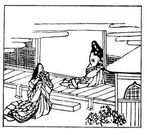

  
[Intangible Textual Heritage](../../index)  [Japan](../index) 
[Index](index)  [Previous](hvj057)  [Next](hvj059) 

------------------------------------------------------------------------

[Buy this Book on
Kindle](https://www.amazon.com/exec/obidos/ASIN/B002HRE8VG/internetsacredte)

------------------------------------------------------------------------

  
*A Hundred Verses from Old Japan (The Hyakunin-isshu)*, tr. by William
N. Porter, \[1909\], at Intangible Textual Heritage

------------------------------------------------------------------------

p. 57

 

### 57

### MURASAKI SHIKIBU

  Meguri-aite  
Mishi ya sore tomo  
  Wakanu ma ni  
Kumo gakure nishi  
Yowa no tsuki kana.

I WANDERED forth this moonlight night,  
  And some one hurried by;  
But who it was I could not see,—  
  Clouds driving o'er the sky  
  Obscured the moon on high..

This lady lost her mother when very young, and her father, the minister
Toyonari Fujiwara, married again. Her skill at composing verses caused
her stepmother to become jealous, and the latter treated her with great
cruelty. She married Nobutaka, a nobleman, and the following verse was
written by her daughter. She is famous in Japanese literature as the
authoress of *Genii Monogatari*, a historical work in fifty-four
sections, which she wrote in the monastery of Ishiyama, near Kyōto. She
was one night taking a moonlight stroll on her verandah and caught sight
of her lover; but, though she barely recognized him, the *Kokinshiu*,
from which the verse is taken, adds that you are to understand that her
reputation was overshadowed from that moment, like the moon behind the
clouds. She died in the year 992.

*Sore tomo* can mean either 'though I glanced at him', or else
(*wakanu*, I did not recognize) 'that friend'.

------------------------------------------------------------------------

[Next: 58. Daini no Sammi](hvj059)
