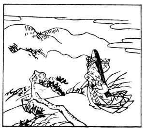

  
[Intangible Textual Heritage](../../index)  [Japan](../index) 
[Index](index)  [Previous](hvj058)  [Next](hvj060) 

------------------------------------------------------------------------

[Buy this Book on
Kindle](https://www.amazon.com/exec/obidos/ASIN/B002HRE8VG/internetsacredte)

------------------------------------------------------------------------

  
*A Hundred Verses from Old Japan (The Hyakunin-isshu)*, tr. by William
N. Porter, \[1909\], at Intangible Textual Heritage

------------------------------------------------------------------------

p. 58

 

### 58

### DAINI NO SAMMI

  Arima yama  
Ina no sasawara  
  Kaze fukeba  
Ide soyo hito wo  
Wasure yawa suru.

As fickle as the mountain gusts  
  That on the moor I've met,  
’Twere best to think no more of thee,  
  And let thee go. But yet  
  I never can forget.

The name given above is only a title, and the real
name of this lady is unknown; she was the daughter of the writer of the
previous verse, and the wife of Daini Nariakira. The picture shows her
on the moor composing the verse. Note the echoing sound in the last
line, '*Wasure* ya*wa* *suru*.'

------------------------------------------------------------------------

[Next: 59. Akazome Emon](hvj060)
