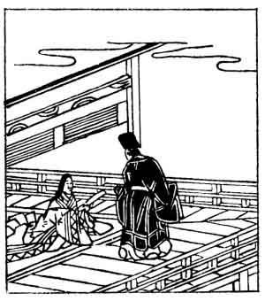

  
[Intangible Textual Heritage](../../index)  [Japan](../index) 
[Index](index)  [Previous](hvj060)  [Next](hvj062) 

------------------------------------------------------------------------

[Buy this Book on
Kindle](https://www.amazon.com/exec/obidos/ASIN/B002HRE8VG/internetsacredte)

------------------------------------------------------------------------

  
*A Hundred Verses from Old Japan (The Hyakunin-isshu)*, tr. by William
N. Porter, \[1909\], at Intangible Textual Heritage

------------------------------------------------------------------------

p. 60

 

### 60

### LADY-IN-WAITING KO-SHIKIBU

### KO-SHIKIBU NO NAISHI

  Ohoye yama  
Ikuno no michi no  
  Tohokereba  
Mada fumi mo mizu  
Ama-no-Hashidate.

SO long and dreary is the road,  
  That I have never been  
To Ama-no-Hashidate;  
  Pray, how could I have seen  
  The verses that you mean?

Koshikibu was the daughter of the writer of verse No.
[56](hvj057.htm#page_56), and early became known as a poetess. The story
goes, that she was suspected of getting help from her mother in
composing poetry; and on one occasion, during the absence of the latter
at Ama-no-Hashidate, she was selected to take part in a poetical contest
at Court. A day or two before the event a nobleman laughingly asked her,
if she was not expecting a letter from her mother, hinting that she
would otherwise be unable to produce a poem good enough for the contest,
and she, touching his sleeve, improvised the above verse. The original
brings in not only Ama-no-Hashidate, a picturesque bay in the Province
of Tango, but also two other proper names, Mount Ohoye and Ikuno, which
are on the road there from Kyōto; but this the translation fails to do.

The last couplet can mean 'I have not walked to or seen Ama-no-Hashidate
', and also, 'I have not seen any letter from Ama-no-Hashidate.'

------------------------------------------------------------------------

[Next: 61. The Lady Ise: Ise no Taiu](hvj062)
